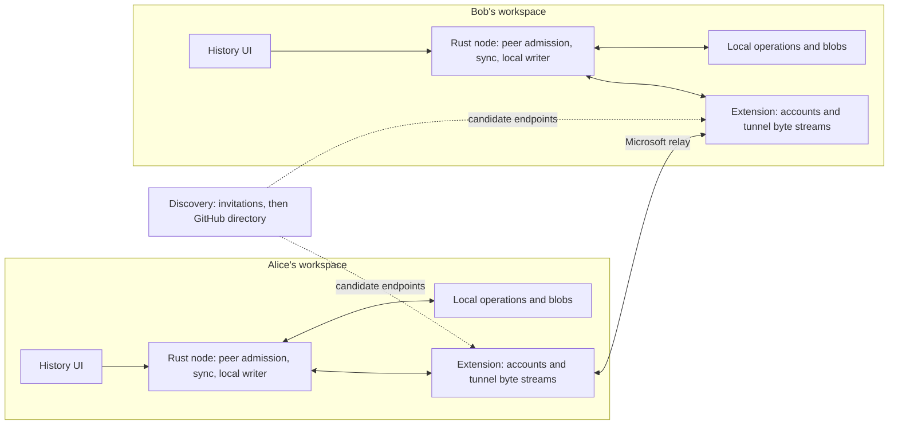

# Multiplayer architecture sketch

**Status:** Implemented through the packaged two-window VS Code E2E. Initially
sketched on September 14, 2026 from `92be7c9` and the successful VS Code spike.
See the [implementation log](multiplayer-implementation.md) for checkpoint
evidence and remaining validation across accounts and networks.

## 1. What the spike establishes

The actual VS Code GitHub session, with `read:user` and `read:org`, successfully
created a private tunnel, connected both endpoints, verified V1 encryption,
exchanged 17,024 bytes each way, and deleted the tunnel. Setup took 2,211 ms;
20 round trips measured p50 14.29 ms and p95 14.60 ms. Recovery also cleared the
previous pending marker. These are smoke-test observations from one extension
host, rather than a latency target for other networks.

This established the Dev Tunnels adapter's feasibility. The implementation now
tests peer enrollment, sustained transfer and durable replication in independent
processes and two VS Code instances. Separate machines and different accounts
still need validation. The spike's host-key and SSH-session comparison benefits
from having both endpoints in one process; remote peers use the device trust
establishment described below.

## 2. Product boundary

The first version shares live EditChain history between independent workspaces.
Each participant keeps a durable local replica and can continue recording while
offline. Sharing is enabled explicitly for a collaboration space. Existing
history requires an explicit backfill selection.

The shared objects are immutable operations and their permitted content blobs.
The History UI renders locally received records and shows missing dependencies
or content. Working-tree synchronization, simultaneous document editing, remote
command execution, and remote browsing of local files are separate features.

Each replica has an explicit outgoing export scope, changeable by its owner.
Fine-grained redaction needs a
separate design: changing an operation's payload while retaining its ID creates
conflicting evidence under the current storage rules.

## 3. Components and ownership

| Component | Responsibility and starting point |
| --- | --- |
| Extension session manager | GitHub session lifecycle, start/join/leave, tunnel cleanup and retries in [the manager](../extensions/vscode-editchain/src/multiplayer/manager.ts). |
| Discovery adapter | Resolve candidate endpoints through invitations and optional repository advertisements independently of replication. |
| Rust peer admission | Authenticate a device and authorize its collaboration space before exposing inventory. |
| `editchain-sync` crate | Transport-independent protocol, inventory comparison, transfer scheduling and reconnect repair, plus the dedicated `editchain-peer` native worker. |
| Rust node integration | Dedicated peer handlers and serialized durable writes, reusing [storage](../crates/editchain-store/src/lib.rs) and [admission](../crates/editchain-core/src/admission.rs). |
| Local projection and UI | Reuse the [retained history projection](../crates/editchain-node/src/history/realtime.rs) to expose received additions and quarantine retractions. |

The extension passes opaque bounded bytes over a dedicated local bridge to the
Rust peer handler. Local control can open and close that bridge. Remote bytes
must never be dispatched as the existing [general service requests](../crates/editchain-protocol/src/lib.rs),
which include local workspace and Git-object access. Peer connections share the
workspace's ingestion coordinator; each connection must not acquire a writer
lock for its entire network lifetime.

## 4. Identity, admission and discovery

Keep four identities distinct:

- **Account:** the GitHub user authorized to call platform APIs.
- **Device:** a persistent cryptographic identity enrolled for sharing.
- **Space:** a stable collaboration ID mapped locally to the permitted chain.
- **Recorded actor:** the original human, agent or tool represented by an operation.

Receiving history from Bob does not make Bob its author. A repository name,
branch name or local path does not establish space membership. Audit existing
node/actor/session ID generation before merging independently captured chains;
preserve original operation IDs, parents, clocks and payload bytes.

The converse also holds: a peer supplying an exact copy of a record this device
already retained does not make that record peer-authored. Local provenance is a
separate durable fact from what a peer supplied.

Enrollment flow: exchange an invitation through a trusted channel
and explicitly approve the device identity. The invitation binds the space,
endpoint and expected device fingerprint. Use a reviewed mutually authenticated
secure channel in Rust. The implementation uses Rustls
[TLS 1.3](https://www.rfc-editor.org/rfc/rfc8446.html#section-4.4)
with pinned device certificates on the dedicated native peer interface.
Keep the SDK's transport encryption checks as well. This avoids building peer
identity around the spike's same-process SSH-session comparison.

Tunnel admission is a separate layer. Start with a private tunnel and a
connect-only grant delivered through the invitation channel. Verify the actual
different-account join and token lifecycle in the next network experiment.
The service documents private access by default and tunnel-scoped client grants.
([Dev Tunnels access model](https://learn.microsoft.com/en-us/azure/developer/dev-tunnels/security#tunnel-access))

GitHub repository variables remain an optional low-frequency directory. Store
only endpoint metadata, device public identity, protocol versions and an
application-enforced expiry. A directory record supplies a candidate endpoint;
it does not independently authorize a new device. Keep bearer grants out of it.
Repository-variable access through OAuth requires `repo` scope and collaborator
access, beyond the spike's scopes.
([GitHub variable API](https://docs.github.com/en/rest/actions/variables#list-repository-variables))

The implemented directory uses API version `2026-03-10`, polls once per minute,
and publishes ten-minute advertisements in one variable per hosting resource.
It validates the public schema, versions, expiry, space and certificate, and can
refresh only an existing approved grant for the same tunnel and cluster. Unknown
devices still require invitations. It cannot move a bearer grant to a different
resource or reenroll a revoked device. API reads, page counts and response sizes
are bounded. Deactivation/Stop withdraw the local advertisement; failed cleanup
leaves stale metadata that expires at the application layer.

## 5. Replication contract

Use a versioned, length-prefixed protocol with bounded frames, batches and
in-flight bytes. Negotiate both peer-protocol and operation-encoding versions.
The implemented messages are defined in [wire.rs](../crates/editchain-sync/src/wire.rs):

| Message | Meaning |
| --- | --- |
| `Hello` | Check the space and both protocol/encoding versions after device authentication. |
| `Inventory` / `Page` | Request a page of exact record identities and digests, with the frozen scope's total count. |
| `Need` / `Chunk` | Transfer one bounded record or permitted blob, including explicit offsets. |
| `Missing` | Leave unavailable content pending for a later reconciliation round. |
| `Ack` | Acknowledge a record or blob only after durable ingestion. |

Idle sessions start another reconciliation round. The native bridge detects
unresponsive peers and resets their connection; TLS owns authenticated shutdown.

Peer protocol 3 walks the consent-filtered snapshot in deterministic parent-first
order. Each `Page` includes its checked absolute position; `Inventory.after` is
the last exact key of the preceding page, rather than a numeric lower bound.
Available parent variants precede their descendants across page boundaries.
Missing/excluded parents are not imported into scope, and cycles retain their
exact evidence with a deterministic traversal break. This prevents normalized
command results with small hashed IDs from reaching the live graph long before
their session backbone. Protocol-1 and protocol-2 peers fail negotiation before inventory.

Every `Page` advertises the same total for that pass. Receivers reject changing
totals, positions beyond the total and contradictory continuation flags, without
allocating from the claimed count. `Checked { end }` confirms a complete page
after its records and content responses finish. The sender accepts it only at
the offered page's end, with no active object or unacknowledged durable receipts.
This also measures already-present records, which correctly produce no new
receipt count. A missing-content response finishes a check but stays visible as
unavailable work; 100% of a check does not conceal missing revision bytes.

Progress exposes separate incoming and outgoing pass totals, checked counts,
known queued records/content, and the current download's buffered byte count.
The UI computes percentages and remaining checks from each fixed total. Buffered
bytes never count as durable receipts. New appends enter the next pass, and a
reconnect begins a fresh check against the durable store.

Each native connection retains an index of exact encoded evidence and follows
the segment append frontier. Inventories share immutable record bytes; incoming
receipt pages update only their own keys, and content receipts resolve only the
record that authorizes them. A receipt no longer replays the entire local chain.
The first inventory still reads existing history, and each round still compares
the approved inventory. Cached readers validate segment metadata, and durable
transactions reread the sharing ledger under the writer lock. Conflicting variants,
excluded history and private-content receipt requirements retain their existing
meaning. A failed storage operation cannot produce an acknowledgment.

**Inventory must include evidence, not just accepted IDs.** The current
[OpSet](../crates/editchain-core/src/admission.rs) retains every distinct encoded
variant and quarantines all variants of a conflicted ID. Use a record key such
as `(OpId, BLAKE3(encoded operation bytes))`, within the negotiated encoding.
Exchange conflict evidence too, preserving those exact bytes. Otherwise Alice
and Bob can each have a different version of ID 7, declare themselves caught up,
and never agree on quarantine. [CanonicalChain](../crates/editchain-store/src/reader.rs)
already exposes the retained evidence needed for an initial implementation.

Start with paginated exact inventories over a stable local snapshot and then
reconcile newly appended evidence. This expresses gaps and conflicts directly;
optimizations such as range digests can follow measured need. A maximum sequence
number, a local segment offset or a UI cursor cannot prove remote completeness.

Transfer operation records independently of physical `.eclog` pages, import
cursors and indexes. Verify blob length and hash before atomic publication.
The first blob-transfer capability covers the existing store's BLAKE3 `Hash256`
references. Preserve unsupported local/128-bit references and report their
content as unavailable; do not silently rewrite immutable operations.

Authorize both inventory and content against the agreed scope. Knowing a blob
hash is insufficient authorization. Missing parents outside the scope remain
explicitly missing; fetching dependencies must not expand sharing implicitly.

Legacy exclusion baselines can admit an independently supplied exact copy as
shareable evidence, with preexisting content still gated by content receipts.
An explicit append cutoff remains in force even for independently received
copies of earlier records. Incoming availability includes those receipts so they
are not repeatedly downloaded, while outgoing inventories continue to exclude
them. Export permission and local authorship remain separate durable facts.

### Changing the outgoing cutoff

The local `set_scope` control operation explicitly chooses all retained history
or a fresh append boundary. It holds the writer lock and records the sequence of
the next segment; selecting a cutoff does not scan the corpus or enumerate a
large exclusion set. Cached evidence retains the first segment of each exact
variant, so appending a duplicate or changing recorded clocks cannot move old
evidence past the boundary. Reconnect and automatic resume only reopen consent.

Each selection increments a durable consent revision. A small `scope-revision`
fence is synced before the updated scope ledger. Live sessions recheck it before
processing messages or starting a pass, including buffered content requests;
the extension also retires active bridges during selection. A crash between the
fence and ledger writes blocks earlier consent and reports an inactive policy.
Repeating an explicit selection repairs it. Previously received copies and device
approvals are preserved. Workers without the new ledger fields reject it rather
than reopening with broader consent. The network protocol remains version 3.

## 6. Durability and live updates

Receive → validate encoding, bounds and scope → classify exact evidence →
persist new records → acknowledge → notify the local projection.

The implementation reuses the writer lock and durable page append behavior in
[SegmentStore](../crates/editchain-store/src/segment.rs), with short serialized
transactions coordinated with editor capture and provider imports through the
same bounded writer-acquisition helper. The peer's exact-byte ingestion path
preserves immutable received evidence. The editor recorder skips normalization
of peer-authored source evidence, preventing duplicate local derivations while
still admitting independently captured work. A record this device retained
locally keeps that provenance even when a peer independently supplies the exact
same bytes, so capture still derives from it and a rebuilt cache cannot
quarantine rows that legitimately used it. The scope ledger therefore stores
received receipts for export gating and local provenance for capture as
separate sets.

The live view presents the latest fully validated occurrence it has received
for each Codex item, including a session slice whose earlier records precede
the export cutoff. Missing outputs or contradictory occurrence proofs still
retract that item; received turn removals retire it. Complete-source logical
replay and cross-session topology retain their full-prefix requirements, so a
visible received revision does not imply that the whole session was shared.
Exact receipt provenance prevents incoming raw Import previews from entering
the graph or search before their occurrence proofs and outputs validate. This
uses the same receipt reader as capture, preserving local fallback rows when
this device independently retained the exact bytes. Received raw-only imports
remain hidden until their authored materialization arrives. Human work envelopes
already carry their semantic record and retain their normal presentation.
Legacy unhashed imports have no derivation proof, so their normalized child
records release them; their raw-only placeholders remain hidden too.
A task path can hide members only while its summary exists,
so a singleton between streamed arrivals remains directly visible.
Live checkpoint version 9 republishes these already-retained partial items from
the reducer indexes, without importing or requesting the excluded history.
Version 10 removes previously cached incoming placeholders without changing
canonical history; the retained reducer publishes items as their remaining
records arrive, including after a restart during transfer.

Operations and blobs have separate completion states. A record can be durable
while its content is still missing. After a crash, rebuild synchronization
progress from durable records and verified blobs. Lost acknowledgments cause
safe duplicate delivery. Neither a completed socket write nor a UI update is a
durability acknowledgment.

Tail persisted local and received records to schedule live transfer. Bound each
peer's queue and pause reads when storage or outbound transport is behind. A slow
or disconnected peer must not block local recording. Quarantine can retract a
previously visible operation; reuse the [tail's added/removed contract](../crates/editchain-store/src/tail.rs).

## 7. Topology and lifecycle

Start with two peers, then a small mesh with one connection per pair and a
deterministic duplicate-connection rule. Any approved holder can supply already
shared evidence. The original author's device need not stay online once another
participant has the data.

`Disabled → Starting → Connecting → Authenticating → Catching up → Live`

Disconnect moves to bounded retry with backoff, followed by inventory repair.
Restart creates a fresh endpoint instance while retaining device and space
identity. Heartbeats run over peer streams. Advertisement expiry only describes
endpoint freshness. A local membership removal closes that device's sessions
and rejects further admission; distributed revocation and its offline policy
need a defined authority before automatic team discovery ships. Previously
received copies cannot be recalled.

Stop is final: a stop request issued while a start, host, join or cleanup
operation is pending must not be undone when that operation completes, and the
session stays disabled until the user explicitly hosts or joins again. Relay
teardown and resource deletion have independent, retryable completion states,
so a disconnect-triggered pause cannot prevent cleanup after a failed initial
connection. Stop waits for the starting host's cleanup, including a deletion
retry. Persistent cleanup failures retain the ownership marker for the manual
cleanup command and report sanitized errors.

## 8. Implementation sequence

| Milestone | Acceptance criterion |
| --- | --- |
| **1. Two-process admission probe** | Separate VS Code instances, different accounts and networks; connect-only invitation; approved device identity succeeds, wrong identity/space fails before inventory; disconnect and cleanup succeed. |
| **2. Rust replication kernel** | Two temporary stores converge through duplicate, reordered and interrupted delivery; test sequence gaps, same-ID conflicts, missing/corrupt blobs and crash-before/after-ack. Use an in-memory or local stream transport. |
| **3. Live history vertical slice** | Attach the tunnel adapter to the kernel; a complete newly persisted operation appears in the other local History UI; offline work catches up after reconnect without reimporting source logs. |
| **4. Discovery and three peers** | Add optional GitHub advertisements; Bob supplies Alice's previously received history to Carol while Alice is offline; duplicate connections and stale advertisements recover predictably. |

The kernel, invitation flow, private relay, recovery and directory are now
implemented. Real relay tests cover independent native processes, exact recorded
diffs, restart catch-up, revocation and three-party forwarding with the source
offline. Directory tests exercise the API contract through controlled responses;
they have not published to a real repository. The packaged extension also passed
the two-window VS Code test: actual approval dialogs and typing, received History
rows and exact diffs in both directions, unchanged receiving working files, and
another edit after a full host restart without a new invitation. Different
accounts and networks remain a separate validation item requiring another
authorized environment.
