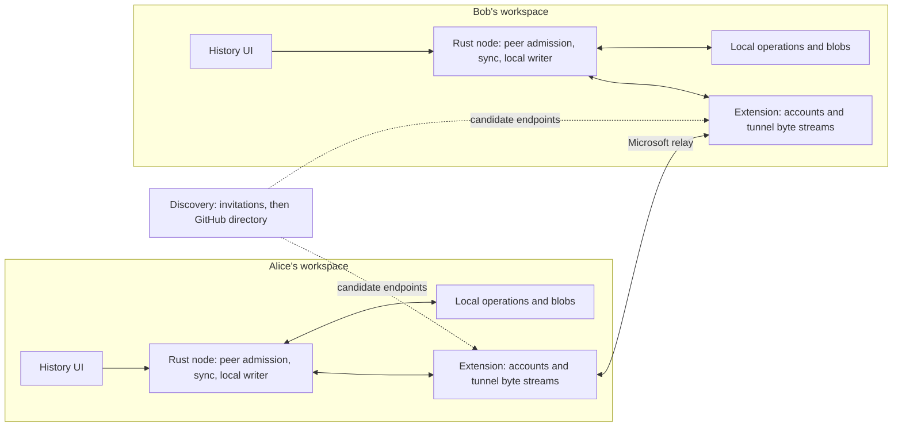

# Multiplayer architecture sketch

**Status:** Architecture accepted for implementation. Initially sketched on
September 14, 2026 from `92be7c9` and the successful VS Code spike. See the
[implementation log](multiplayer-implementation.md) for tested checkpoints.

## 1. What the spike establishes

The actual VS Code GitHub session, with `read:user` and `read:org`, successfully
created a private tunnel, connected both endpoints, verified V1 encryption,
exchanged 17,024 bytes each way, and deleted the tunnel. Setup took 2,211 ms;
20 round trips measured p50 14.29 ms and p95 14.60 ms. Recovery also cleared the
previous pending marker. These are smoke-test observations from one extension
host, rather than a latency target for other networks.

This is enough to design around the Dev Tunnels adapter. Separate machines,
different accounts, peer enrollment, sustained transfer, and durable history
replication remain to be tested. The spike's host-key and SSH-session comparison
benefits from having both endpoints in one process; remote peers need their own
trust establishment.

## 2. Product boundary

The first version shares live EditChain history between independent workspaces.
Each participant keeps a durable local replica and can continue recording while
offline. Sharing is enabled explicitly for a collaboration space. Existing
history requires an explicit backfill selection.

The shared objects are immutable operations and their permitted content blobs.
The History UI renders locally received records and shows missing dependencies
or content. Working-tree synchronization, simultaneous document editing, remote
command execution, and remote browsing of local files are separate features.

An initial space has one agreed export scope. Fine-grained redaction needs a
separate design: changing an operation's payload while retaining its ID creates
conflicting evidence under the current storage rules.

## 3. Components and ownership

| Component | Responsibility and starting point |
| --- | --- |
| Extension session manager | GitHub session lifecycle, start/join/leave, tunnel cleanup and retries; grow from [the spike](../extensions/vscode-editchain/src/devTunnels/spike.ts). |
| Discovery adapter | Resolve candidate endpoints through invitations initially; add repository advertisements independently of replication. |
| Rust peer admission | Authenticate a device and authorize its collaboration space before exposing inventory. |
| `editchain-sync` crate | Transport-independent protocol, inventory comparison, transfer scheduling and reconnect repair, plus the dedicated `editchain-peer` native worker. |
| Rust node integration | Dedicated peer handlers and serialized durable writes, reusing [storage](../crates/editchain-store/src/lib.rs) and [admission](../crates/editchain-core/src/admission.rs). |
| Local projection and UI | Reuse the [retained history projection](../crates/editchain-node/src/history/realtime.rs) to expose received additions and quarantine retractions. |

The extension passes opaque bounded bytes over a dedicated local bridge to the
Rust peer handler. Local control can open and close that bridge. Remote bytes
must never be dispatched as the existing [general service requests](../crates/editchain-protocol/src/lib.rs),
which include local workspace and Git-object access. Peer connections share the
workspace's ingestion coordinator; each connection must not acquire a writer
lock for its entire network lifetime.

## 4. Identity, admission and discovery

Keep four identities distinct:

- **Account:** the GitHub user authorized to call platform APIs.
- **Device:** a persistent cryptographic identity enrolled for sharing.
- **Space:** a stable collaboration ID mapped locally to the permitted chain.
- **Recorded actor:** the original human, agent or tool represented by an operation.

Receiving history from Bob does not make Bob its author. A repository name,
branch name or local path does not establish space membership. Audit existing
node/actor/session ID generation before merging independently captured chains;
preserve original operation IDs, parents, clocks and payload bytes.

Enrollment flow: exchange an invitation through a trusted channel
and explicitly approve the device identity. The invitation binds the space,
endpoint and expected device fingerprint. Use a reviewed mutually authenticated
secure channel in Rust. The implementation uses Rustls
[TLS 1.3](https://www.rfc-editor.org/rfc/rfc8446.html#section-4.4)
with pinned device certificates on the dedicated native peer interface.
Keep the SDK's transport encryption checks as well. This avoids building peer
identity around the spike's same-process SSH-session comparison.

Tunnel admission is a separate layer. Start with a private tunnel and a
connect-only grant delivered through the invitation channel. Verify the actual
different-account join and token lifecycle in the next network experiment.
The service documents private access by default and tunnel-scoped client grants.
([Dev Tunnels access model](https://learn.microsoft.com/en-us/azure/developer/dev-tunnels/security#tunnel-access))

GitHub repository variables remain an optional low-frequency directory. Store
only endpoint metadata, device public identity, protocol versions and an
application-enforced expiry. A directory record supplies a candidate endpoint;
it does not independently authorize a new device. Keep bearer grants out of it.
Repository-variable access through OAuth requires `repo` scope and collaborator
access, beyond the spike's scopes.
([GitHub variable API](https://docs.github.com/en/rest/actions/variables#list-repository-variables))

The implemented directory uses API version `2026-03-10`, polls once per minute,
and publishes ten-minute advertisements in one variable per hosting resource.
It validates the public schema, versions, expiry, space and certificate, and can
refresh only an existing approved grant for the same tunnel and cluster. Unknown
devices still require invitations. It cannot move a bearer grant to a different
resource or reenroll a revoked device. API reads, page counts and response sizes
are bounded. Deactivation/Stop withdraw the local advertisement; failed cleanup
leaves stale metadata that expires at the application layer.

## 5. Replication contract

Use a versioned, length-prefixed protocol with bounded frames, batches and
in-flight bytes. Negotiate both peer-protocol and operation-encoding versions.
The implemented messages are defined in [wire.rs](../crates/editchain-sync/src/wire.rs):

| Message | Meaning |
| --- | --- |
| `Hello` | Check the space and both protocol/encoding versions after device authentication. |
| `Inventory` / `Page` | Request a page of exact record identities and digests in that scope. |
| `Need` / `Chunk` | Transfer one bounded record or permitted blob, including explicit offsets. |
| `Missing` | Leave unavailable content pending for a later reconciliation round. |
| `Ack` | Acknowledge a record or blob only after durable ingestion. |

Idle sessions start another reconciliation round. The native bridge detects
unresponsive peers and resets their connection; TLS owns authenticated shutdown.

**Inventory must include evidence, not just accepted IDs.** The current
[OpSet](../crates/editchain-core/src/admission.rs) retains every distinct encoded
variant and quarantines all variants of a conflicted ID. Use a record key such
as `(OpId, BLAKE3(encoded operation bytes))`, within the negotiated encoding.
Exchange conflict evidence too, preserving those exact bytes. Otherwise Alice
and Bob can each have a different version of ID 7, declare themselves caught up,
and never agree on quarantine. [CanonicalChain](../crates/editchain-store/src/reader.rs)
already exposes the retained evidence needed for an initial implementation.

Start with paginated exact inventories over a stable local snapshot and then
reconcile newly appended evidence. This expresses gaps and conflicts directly;
optimizations such as range digests can follow measured need. A maximum sequence
number, a local segment offset or a UI cursor cannot prove remote completeness.

Transfer operation records independently of physical `.eclog` pages, import
cursors and indexes. Verify blob length and hash before atomic publication.
The first blob-transfer capability covers the existing store's BLAKE3 `Hash256`
references. Preserve unsupported local/128-bit references and report their
content as unavailable; do not silently rewrite immutable operations.

Authorize both inventory and content against the agreed scope. Knowing a blob
hash is insufficient authorization. Missing parents outside the scope remain
explicitly missing; fetching dependencies must not expand sharing implicitly.

## 6. Durability and live updates

Receive → validate encoding, bounds and scope → classify exact evidence →
persist new records → acknowledge → notify the local projection.

Reuse the writer lock and durable page append behavior in
[SegmentStore](../crates/editchain-store/src/segment.rs), with short serialized
transactions coordinated with editor capture and provider imports. The existing
[import writer](../crates/editchain-node/src/commands/import/persistence.rs) shows
admission and durable append, but its decoded-operation interface needs an
explicit exact-byte path for replicated evidence.

Operations and blobs have separate completion states. A record can be durable
while its content is still missing. After a crash, rebuild synchronization
progress from durable records and verified blobs. Lost acknowledgments cause
safe duplicate delivery. Neither a completed socket write nor a UI update is a
durability acknowledgment.

Tail persisted local and received records to schedule live transfer. Bound each
peer's queue and pause reads when storage or outbound transport is behind. A slow
or disconnected peer must not block local recording. Quarantine can retract a
previously visible operation; reuse the [tail's added/removed contract](../crates/editchain-store/src/tail.rs).

## 7. Topology and lifecycle

Start with two peers, then a small mesh with one connection per pair and a
deterministic duplicate-connection rule. Any approved holder can supply already
shared evidence. The original author's device need not stay online once another
participant has the data.

`Disabled → Starting → Connecting → Authenticating → Catching up → Live`

Disconnect moves to bounded retry with backoff, followed by inventory repair.
Restart creates a fresh endpoint instance while retaining device and space
identity. Heartbeats run over peer streams. Advertisement expiry only describes
endpoint freshness. A local membership removal closes that device's sessions
and rejects further admission; distributed revocation and its offline policy
need a defined authority before automatic team discovery ships. Previously
received copies cannot be recalled.

## 8. Implementation sequence

| Milestone | Acceptance criterion |
| --- | --- |
| **1. Two-process admission probe** | Separate VS Code instances, different accounts and networks; connect-only invitation; approved device identity succeeds, wrong identity/space fails before inventory; disconnect and cleanup succeed. |
| **2. Rust replication kernel** | Two temporary stores converge through duplicate, reordered and interrupted delivery; test sequence gaps, same-ID conflicts, missing/corrupt blobs and crash-before/after-ack. Use an in-memory or local stream transport. |
| **3. Live history vertical slice** | Attach the tunnel adapter to the kernel; a complete newly persisted operation appears in the other local History UI; offline work catches up after reconnect without reimporting source logs. |
| **4. Discovery and three peers** | Add optional GitHub advertisements; Bob supplies Alice's previously received history to Carol while Alice is offline; duplicate connections and stale advertisements recover predictably. |

The kernel, invitation flow, private relay, recovery and directory are now
implemented. Real relay tests cover independent native processes, exact recorded
diffs, restart catch-up, revocation and three-party forwarding with the source
offline. Directory tests exercise the API contract through controlled responses;
they have not published to a real repository. The next checkpoint exercises the
packaged extension in two real VS Code instances. Different accounts and networks
remain a separate validation item requiring another authorized environment.
