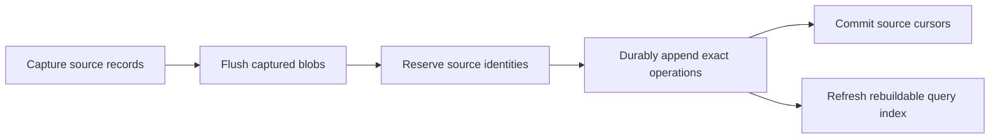

# Large-history write paths

The base engine keeps original encoded operations in append-only segments and
content-addressed blobs. Exact bytes determine duplicate and conflict admission;
derived indexes can be rebuilt. Performance changes must preserve those contracts,
including failure outcomes and durable acknowledgements.

Source reservations protect identities after an uncertain append. They do not
advance the accepted cursor. An interruption before cursor commit intentionally
replays retained evidence on the next import.

## Import and streaming append

`LogStore` previously reconstructed the accumulated canonical chain before every
operation. Importing N operations therefore performed quadratic replay work.
It now reads exact evidence once while holding the adapter's exclusive writer
ownership and updates that evidence after successful writes. A failed write or
durability fence invalidates the cache. Retrying then discovers any committed
prefix from storage and fences existing evidence before acknowledging it.

`AppendLog::append_records` gives adapters an ordered durable batch contract. The
filesystem implementation packs pages up to its segment target; it retains the
existing allowance for a single oversized record. Success covers the whole
batch, while failure can retain a prefix. It does not make a batch atomic.
Import persistence uses at most 1,024 records or approximately 4 MiB per batch
(a single larger record remains allowed). Source cursors advance only after
all their operations are durable.

For multiple library writes, retain `Engine::writer()` and use its `append`,
`append_encoded`, `append_encoded_batch`, and `store_blob` methods. Dropping the
`ChainWriter` releases exclusive ownership. Single-call `Engine::append` remains
available, with a new admission scan for each independent writer lifetime.
The CLI retains one writer across a JSON/JSONL append stream. Archive restore
uses bounded batches and emits ordered replies after persistence succeeds.

Blob publication also supports ordered batches. Up to 64 temporary files are
staged before their data is synchronized and their immutable names are published;
the cohort shares a directory publication fence. Existing destinations and
publication races still verify exact bytes, and a failed fence returns no
acknowledgement. The CLI importer uses a 64-payload / 4 MiB `BufferedBlobSink`,
flushing all captured content before persisting operations or checkpoints.
Archive restore similarly persists its pending blobs before acknowledging a
batch. Larger individual import payloads go directly to durable storage.
Exact duplicate payloads within a cohort are staged once. At most eight data
synchronization workers run concurrently, and all finish before final names are
published. The directory publication fence completes before success is returned.

## Replication

The portable `StoreReplica` adapter retains exact evidence while it owns the
writer. Record and blob receipts reuse it instead of replaying the corpus on
each receipt. Outgoing snapshots share immutable encoded bytes. Export policy
checks still apply to each reconciliation snapshot and content access. Failed
record writes discard uncertain cached evidence; retries re-establish durability.
No wire format or sharing policy changes are required.

## Costs that remain

Cold writers still scan existing encoded evidence and keep an in-memory map.
Integrity, rebuild, export, and full replication inventories necessarily visit
the selected corpus. Query indexes already have persistent pages and bounded
history cursors; an unbounded series of pages still visits the entire selection.
Filesystem synchronization, blob publication, parsing and archive serialization
remain material costs. These changes do not establish a constant-memory or
unlimited-history guarantee.

The sibling `editchain-sessions-raw` repository runs the actual release CLI over
the selected Claude, Codex and human corpus. Its full suite checks complete
import/replay and exercises all public commands on full corpus copies, including
export/restore and full replication inventories. Deterministic Rust regression
tests additionally count log replays and inject write/fence failures, so the
quadratic paths cannot return unnoticed behind fast small fixtures.

The 2026-09-27 full evaluation passed all 22 cases over 501,515 source records
and 1,451,212 imported operations. It independently covered all 26 commands,
14 operation families, and 30 content fields on full-history copies. Every raw
source record matched its original bytes, and the 11.97 GB archive round trip
was byte-identical. Full inventory replication with bidirectional additions and
retry also passed. Detailed counts, executable hashes, timings, and limitations
are recorded in `editchain-sessions-raw/evals/SCALING.md`.

This run is a correctness baseline, not a latency target. Its harness launched
142 import processes, and concurrent Rust tests affected early import timings.
The CLI now supports `import --glob '**/*.jsonl'` and mixed-provider
`import --manifest sources.json`. These modes discover sources once, capture and
persist one file at a time, and reuse one writer's admission state across the
entire invocation. Capture limits apply per file; source identities, blob fences,
and durable checkpoints retain their existing contracts. Reports include source
counts and selection, capture/blob, admission/cursor, and total timings. The
older whole-invocation capture remains available for ordinary imports.
The fresh 2026-09-28 bulk import admitted all 1,451,212 operations from the same
507 files in one CLI process, measured at 202.045375 seconds. Internal timings
attribute 177.660816 seconds to capture/helper/blob work and 19.901329 seconds to
admission/cursor commits. The original 1,685.449577-second, 142-process run had
competing test load, so the observed difference does not isolate batching's
contribution. The bulk run's identity and validation are recorded in the archive
repository's scaling report. Its 18-case import evaluation passed; unchanged
re-import wrote zero operations in 5.628651 seconds. A complete 11,974,882,852-byte
archive export was byte-identical to the previous import through the frozen CLIs.
Complete operation metadata still scans
history for incoming relationships and measured about 81 seconds on this corpus.
