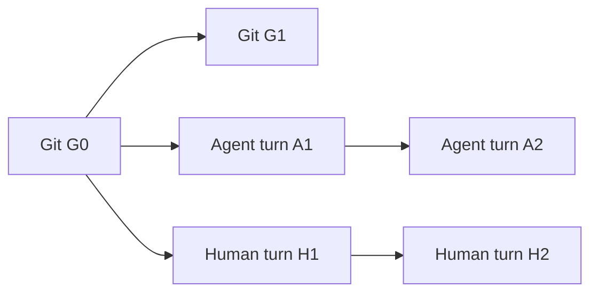

# Human and agent turns branching from Git

Status: design analysis from before the integration. The implemented capture,
Git-anchored human series, exact file diffs, live episode disclosure, replay
contract, and remaining environment-observation limits are documented in
[VS Code human work](vscode-human-work.md#human-work-in-history). The broader
shared-state index and complete execution replay discussed below remain design
work. Intentional typing is a useful human-work indicator; focus is not stored.

The follow-up [shared-workspace research and comparison](vscode-shared-workspace-research.md)
examines isolation alternatives and refines this proposal with revision occurrence
identity, separate read/application bases, and safe grouping of interleaved turns.
Its capture-boundary analysis also makes external changes and environment drift
explicit: agent tool boundaries cannot substitute for workspace observation or
establish complete execution replay.

Human work should use the same Git-anchored session and turn structure as agent
work. Both can operate on one shared working tree, including changes that have
never been staged or committed. A visual branch represents a series of work;
it does not imply a separate Git branch, checkout, or private copy of the files.

## The existing visualization and projection

The VS Code extension hosts one Rust/WASM History view with graph, activity,
tags, content and date columns. Source operations are projected into semantic
rows, work groups and file details; the frontend renders their provided lane
geometry. Human turns belong in this same surface and disclosure structure.

The current path is:

```text
canonical source evidence and normalized operations
  -> session/turn semantics, Git relationships, file changes
  -> collapse and Activity projection (or retained live logical items)
  -> resolved visible parents and compact lane geometry
  -> HistoryRow / LiveBlock
  -> Rust/WASM rows, expansion and native VS Code file diffs
```

Important existing contracts:

| Existing code | Contract to reuse |
| --- | --- |
| [Codex session Git capture](../crates/editchain-import/src/codex/session_git.rs) | Emits one exact `GitLinkKind::BasedOn` from recorded session metadata to the repository-qualified base commit. It does not substitute current HEAD at query time. |
| [History node ancestry and grouping](../crates/editchain-project/src/node.rs) | Raw source parents continue the series; Git links anchor it. Raw imports fold with normalized children. `ScopeRef::Session` supplies the display group; unscoped operations become `ops`. |
| [Activity contraction](../crates/editchain-project/src/activity.rs) | Work groups preserve legitimate external parents and protect structural endpoints. Current grouping uses conversational/session boundaries; human work needs explicit turn boundaries so an entire recording does not become one group. |
| [Git and operation layout](../crates/editchain-project/src/layout.rs) | Git occupies lane zero. Sessions based on the same commit can share a routing spine. Disjoint sessions reuse operation lanes; overlapping causal tracks remain distinguishable. |
| [Retained live ancestry](../crates/editchain-node/src/history/realtime/ancestry.rs) | Lifts source parents through hidden evidence and resolves explicit Git links incrementally. |
| [File operation](../crates/editchain-core/src/op.rs) | `FileOp` already has lifecycle stage, before/after content identities and retained edits. |
| [File-row presentation](../crates/editchain-node/src/history/presentation.rs) | Turns/work groups expose source-control-style file children and route clicks to recorded diffs. |
| [Native diff opening](../extensions/vscode-editchain/src/extension.ts) | `openDiff` requests authoritative retained sides through `GetFileDiff`; the existing UI is reusable. |

A human recording therefore needs a real session identity, human turn semantics,
its own ordered source chain, an exact captured Git base, and normalized file
changes. Its first visible turn inherits the series' Git anchor; later turns
continue that series. Do not make every turn an unrelated child of Git or reserve
a permanent screen column for every human. Reuse the existing causal lane plan,
including existing agent spawn/fork/reconnect behavior.

A diagram of the normal work graph, drawn oldest to newest for clarity:



The History list remains newest first. The diagram omits any specific
produced-commit or cross-turn state-use links; those require recorded evidence.
All four turns can concern the same working tree between G0 and G1. None requires
a Git merge merely because the graph has two work branches.

## Shared intermediate state is essential

The Git anchor alone is not the actual input to a turn. The relevant state has
four distinct parts:

```text
Git base commit
  + recorded index/staging state
  + recorded working-tree file revisions, including untracked files
  + per-editor unsaved buffer revisions
```

These are layers with independent identities, not ownership claims. The index
can contain one revision, disk another, and an unsaved editor a third. Agents
using filesystem tools normally see disk; human exposure concerns the actual
buffer on screen. An extension-based agent may modify that buffer directly.

For example, all these activities remain based on Git G0:

| Step | Actual input | Activity | Result |
| --- | --- | --- | --- |
| Initial state | G0 plus existing unstaged edits U | Capture the known baseline | S0 |
| A1 | S0 | Agent changes `parser.rs` | S1 |
| H1 | S1 | Human edits the newly generated code | S2 |
| A2 | S2 | Agent extends the file, retaining H1's change | S3 |
| H2 | Visible buffer at S3 | Human reads the affected lines | S3, plus reading evidence |

A1's diff is S0 to S1 for its changed file, H1's is S1 to S2, and A2's is S2 to S3.
Calculating every diff from G0 would repeatedly attribute U and other actors'
changes to the current turn. The user's goal requires retaining the intermediate
revisions before any commit exists.

There are two distinct kinds of continuity:

- **Work continuity:** A1 to A2 and H1 to H2, with each series rooted at its
  recorded Git base. These are the normal projected branches.
- **State use:** H1 used the state produced by A1; A2 used a state containing H1's
  contribution. Record these exact dependencies without replacing either work
  chain or implying a Git merge. Show the relevant state/lineage connections
  when inspecting a turn or file; avoid overwhelming the normal graph with a
  separate primary node for every file version.

Both actors acting around the same time does not by itself create divergent file
states. When the actual observed before-state includes the other's edit, the
working copy has advanced normally. Show divergence only for genuinely different
bases, separate buffers/worktrees, or a stale operation. Show an overwrite only
when the actual application evidence establishes discarded work.

## A turn's edits and its observed context are different

A turn should retain:

- session, actor, turn and repository/worktree identities;
- its recorded Git-base context and predecessor in its work series;
- references to the intermediate state and exact per-file revisions it used;
- the file operations attributable to that turn, with exact before/after sides
  where available;
- read/exposure evidence, saved/staged status and coverage derived from those
  revisions;
- original source-operation identities for inspection and replay.

A long agent turn may begin at S0 while human edits happen before it finishes.
Its final workspace snapshot can contain those human changes. The difference
between its initial and final workspace snapshots is therefore not automatically
the agent's authored delta. Keep `own_changes` separate from observed input/output
context and resolve attribution at the actual operation/transition level.

A turn may also read one file before a human update and another afterwards.
Per-operation/per-file revision references are authoritative; a single turn-start
workspace ID must not imply every later operation consumed that frozen state.
Disjoint file changes can commute. Same-file transitions need matching input
revisions or explicit unresolved/divergent evidence.

State references should use a retained per-worktree revision index with sparse,
content-addressed changes, rather than copying the repository for every keypress.
A state reference describes the known captured revisions and completeness; it
must not claim an atomic snapshot of all concurrently changing files. Initial
dirty/untracked content is retained without assigning its authorship unless
agent or human evidence establishes it.

## What is missing today

1. [Human event admission](../crates/editchain-node/src/editor.rs) currently emits
   unscoped `ImportOp`s with a source-order predecessor. There is no session-scope
   metadata, normalized turn/file structure or `BasedOn` link for the recorder.
   `tracking_started` also carries no captured Git/worktree context.
2. [Preview compaction](../crates/editchain-node/src/history/legacy_preview.rs)
   does not preserve the editor envelope's semantic fields. The graph consequently
   shows imports, often with an empty type, and author `system`.
3. [File projection](../crates/editchain-node/src/history/files.rs) is organized
   around Git and agent changes. `FileChangeSource` currently has Git, Agent and
   Unknown, and the extension labels non-Git diffs as agent. Simply emitting
   human `FileOp`s without extending this path would mislabel them and could
   feed them into the AI-origin index.
4. Some retained agent diffs are partial. Claude tool previews can reconstruct
   against the session Git base and explicitly warn that intervening edits may
   be absent. Codex updates often retain hunks without complete sequential file
   snapshots. These fallbacks cannot serve as a complete shared-state history.
   Actual observed before/after revisions should enrich those operations when
   matched; unresolvable history remains partial.
5. [Live Git tracking](../crates/editchain-node/src/history/realtime/git.rs)
   tracks refs, HEAD and commit objects. It can return early while HEAD and refs
   remain unchanged. It is not an observer of all index, unstaged or buffer
   changes; source/editor evidence and additional working-state capture must
   supply that information.
6. Historical expansion currently exports nested activities with synthetic keys
   and empty parent relationships, while the renderer draws their dots. This
   loses the internal chain. Live mode preserves raw sequence edges but exposes
   too many unclassified events. Both must project the same meaningful turns.

The previous screenshot-session audit found 560 historical expanded rows with
zero exposed parent links, versus 555 live rows with 546 parent-bearing rows.
Both had zero human-labeled rows. These are fixture-specific observations, not
a statement about every graph. Details remain under
`outputs/vscode-capture/concurrent-graph-review/`.

## Integration using the existing model

1. **Capture the human Git and working-state context.** Use the existing
   repository/worktree catalog and record the exact observed HEAD alongside the
   initial buffer and dirty-state evidence. Bind context to capture time, not
   delayed outbox delivery. Record explicit context changes across checkout,
   reset, commit and tracking gaps; never retarget old work to today's HEAD.
   Reuse the existing `BasedOn` semantics at series/context boundaries. Missing
   old context or an unborn repository remains explicit rather than inventing
   a historical Git anchor.
2. **Normalize human turns.** Keep raw observations immutable. Resolve
   `human_edit` against its `document_changed` occurrence and derive stable
   session/turn identities plus human-attributed file actions. Follow the
   existing pattern of a session-scoped raw backbone and turn-scoped normalized
   children/metadata. `ScopeRef` is singular; setting only `ScopeRef::Turn` on
   the backbone currently loses session grouping.
3. **Use the common Activity and file-row projection.** Human turns appear as
   ordinary work/read activities with expandable files, exact recorded native
   diffs and origin coverage. Give human turns explicit boundaries; current
   chat-based contraction would otherwise swallow an entire human work series.
   Human turns may contain multiple edit bursts/files. Respect current
   interleaving rules when forming visible work groups; a semantic turn can
   retain its identity across multiple visible fragments.
4. **Retain shared working-state transitions.** Reuse `FileOp.base/after` and
   the blob store, with repository/worktree/path and buffer-incarnation scope.
   Index observed applied changes from all producers. A matching agent write
   seen by the editor is one modification with additional observation evidence.
   Do not union their raw parent sets or invent a human-to-agent work-order edge.
   Keep source attribution distinct from observation source.
5. **Fix expansion and live materialization together.** Resolve Git anchors
   through hidden metadata exactly as for agent turns. Preserve real internal
   and boundary parents for graph-bearing expanded members; supporting details
   do not acquire independent activity dots. Retain existing shared Git routing,
   lane reuse, forks, pagination, stable row identity and live DOM/selection.
6. **Join coverage to that same state index.** Mark the AI-origin lines present
   in the exact buffer revision read or edited. Carry unchanged origins through
   shared unstaged transitions. A later AI replacement gives changed lines new
   origins, while prior human work remains in history. Do not count unrelated
   initial dirty code as newly AI-generated or human-authored.

Normal human-turn boundaries should be derived from bounded work episodes and
explicit lifecycle/context boundaries, with edit bursts as finer details. They
are presentation policy, not evidence that the worktree was clean or the person
finished a conceptual task. No fabricated chat messages are needed to force the
existing grouping pass to create turns.

On a later commit, retain real Git parentage. Existing `ProducedBy` evidence can
link the committing operation to the commit; this identifies the operation that
created the commit, not the author of every included line. The commit takes its
contents from the index, which may include both human and agent contributions
and exclude newer unstaged edits. Preserve those origins and any remaining dirty
state. Do not reset working-state tracking to a clean copy merely because HEAD
advanced.

Read-only human turns also belong to the series. Their input/output file content
may be identical; their contribution is revision-bound exposure evidence. Opening
a tab is supporting evidence, qualifying dwell is a reading indicator, and neither
is proof of comprehension. Focus remains an in-memory guard only.

## Acceptance scenarios

The primary end-to-end scenario is one real Git repository and one shared dirty
working tree, not two isolated checkouts later joined by a synthetic merge:

1. Start at G0 with pre-existing staged, unstaged and untracked content.
2. An agent changes a file; a human edits that generated content before a commit.
3. The agent continues from the human-modified disk state; the human reads the
   resulting buffer. Assert the exact intermediate diffs and line coverage.
4. Verify the graph shows two turn series rooted at G0, with correct turn order,
   expandable file evidence and inspectable shared-state dependencies.
5. Commit only part of the work. Assert the Git commit reflects the index,
   preserves mixed origins, and leaves remaining unstaged state intact.
6. Reopen and compare expanded semantics and coverage with the live view.

Additional required cases:

- Multiple human turns remain one connected series, with correct Git anchoring
  after metadata hiding, grouping and expansion.
- An agent turn spans concurrent human edits; its own-change count excludes
  unrelated human changes in the ending workspace state.
- Human/agent operations on different files preserve each other's revisions.
- A dirty editor buffer differs from the agent's disk view; neither receives
  reading or editing credit for a revision it did not observe.
- Genuine stale-base writes, overwrite, undo/redo and external changes retain
  their actual state relationships; overlap in time alone creates no fork.
- Two editor observations of an agent write produce one attributed modification.
- HEAD changes with carried dirty state preserve old anchors and record new
  context; separate worktrees with the same commit are not treated as one state.
- Delayed provider imports and outbox replay preserve identities, graph anchors,
  state transitions and coverage without duplicates.
- Incomplete legacy diffs/context remain visibly partial and do not manufacture
  exact intermediate state.
- View expansion, filtering, live updates and paging retain meaningful edges,
  compact Git routing and selection without full-history work per keystroke.

Verification in this review: the existing
`sessions_with_one_git_base_share_spine_and_reuse_operation_lane` layout test
passed, and `bundled_meta_based_on_link_is_inherited_by_visible_anchor` passed.
The earlier four branching/interleaving regressions also passed. These confirm
existing projection machinery to reuse; the new mixed-state scenarios remain
implementation acceptance work. No production code or quality policy was changed
for this analysis.
