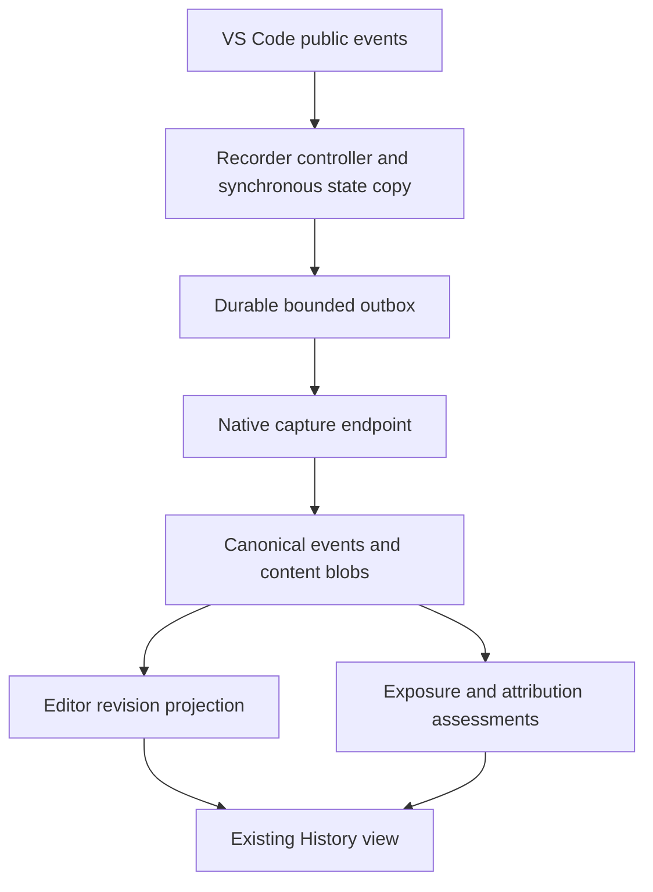

> Implementation update: the stable-API recorder and human-work coverage report
> are now integrated. The agreed policy treats keyboard-correlated changes as
> human indicators and uses focus only as an in-memory timer guard. See
> [the implementation contract](vscode-human-work.md). The research below
> describes the original investigation and its API constraints.

# VS Code editor capture: research and implementation plan

Research cutoff: **September 11, 2026**. Status: **desktop feasibility tests added; production capture remains proposed**. See the [runtime findings and reproduction commands](vscode-editor-capture-results.md).

## Executive summary

- Build this into the existing VS Code extension. Stable APIs cover document edits, open tabs, visible editors, active-editor changes, selections, and vertical viewport ranges. Most required hooks already exist in the extension's minimum VS Code version, 1.85. [Current API][api]; [1.85 declarations][api185].
- Record **editor-observed changes** with explicit attribution evidence. The stable change event cannot reliably distinguish human typing/paste from edits made by another extension. An independent extension developer confirmed this limitation; the current implementation still has a separate restricted event path for richer reasons. [Developer discussion][origin-discussion]; [event routing][api-impl].
- A useful newer option exists: the proposed `textDocumentChangeReason` API supplies `detailedReason.source` and metadata. Evaluate it in a separate experimental build; the production recorder should work without it. [Proposal][reason-proposal]; [proposed API distribution rules][proposed-guide].
- Treat viewport and time measurements as evidence of **exposure and navigation**, with reading/skimming as an optional, explicitly inferred interpretation. No event inspected supplies gaze or comprehension. A relevant study separately measured IDE actions and eye fixations when identifying reading behavior. [API][api]; [Tang et al., Table II][reading-study].
- Make recording independent of the History panel. Introduce durable editor-event ingestion, then editing history, then viewport summaries. This order makes the provenance and recovery foundation useful before adding behavioral inference.

## Scope and method

The decision is how EditChain should record a developer's coding activity and later answer questions such as “what changed?”, “which files were open?”, and “which parts were exposed before an edit?”. “Open” is decomposed into a loaded document, a tab, a visible editor, and the active editor. “Human” describes attribution, not merely the machine or editor in which a change appeared.

I ran 24 targeted live-search queries across API discovery, primary evidence, independent implementations, counterexamples, and freshness checks. I inspected official documentation, released VS Code source, extension-developer reports, WakaTime and ActivityWatch source, and original behavioral research. No subagents or delegated research were used. Microsoft documentation and Microsoft implementation are one evidence origin; separate extension implementations corroborate feasibility but do not independently validate every VS Code behavior.

The official update endpoint returned **VS Code 1.137.0**, commit `645f29cc3176500b4b5762ba887cf2a7f0ffdf2c`. Implementation references below are pinned to that commit. I also compared the relevant declarations against 1.85.0. The original source/API audit is supplemented by the subsequent [runtime experiments](vscode-editor-capture-results.md). [Stable update metadata][stable-update]; [1.137 release][release]; [released declarations][api-current].

Repository findings refer to the supplied working tree at HEAD `e5d9367`, including its existing uncommitted realtime work. The initial planning delivery added this document; the follow-up adds an isolated test extension and runtime suite. First delivery targets ordinary text editors on desktop; remote hosts, diff editors, and other editor types have explicit follow-up checks below.

## Detailed findings

### 1. Event coverage and its meaning

The following is the proposed collection contract. The last column distinguishes API evidence from its intended interpretation in EditChain.

| Need | Public API | Observable fact and interpretation |
| --- | --- | --- |
| Unsaved text edits | `workspace.onDidChangeTextDocument` | A document transaction with replacement ranges/text and undo/redo reason where known. Preserve the whole transaction. [Event implementation][documents]. |
| Save lifecycle | `onWillSaveTextDocument`, `onDidSaveTextDocument` | Save intent/reason and successful-save notification. Save is a separate event from editing. [1.85 declarations][api185]. |
| Loaded document lifecycle | `workspace.textDocuments`, `onDidOpenTextDocument`, `onDidCloseTextDocument` | Model lifetime, including language changes; not tab lifetime. [API][api]. |
| Open tabs and groups | `window.tabGroups.all`, `onDidChangeTabs`, `onDidChangeTabGroups` | Opened/closed/changed tabs, group membership, preview/pinned/selected state. [Tab implementation][tabs]. |
| Visible code editors | `window.visibleTextEditors`, `onDidChangeVisibleTextEditors` | Editor instances currently presented, including multiple views of one document. [Editor implementation][editors]. |
| Active code editor | `window.activeTextEditor`, `onDidChangeActiveTextEditor` | Current or most recently active code editor; handle `undefined`. [Released declarations][api-current]. |
| Viewport movement | `TextEditor.visibleRanges`, `onDidChangeTextEditorVisibleRanges` | Changed vertical ranges, not physical scroll input. [Viewport implementation][viewport]. |
| Cursor/selections | `onDidChangeTextEditorSelection` | Selections plus an optional keyboard/mouse/command category. Preserve as interaction evidence. [Editor implementation][editors]. |
| Window focus | `window.state.focused`, `onDidChangeWindowState` | Workbench-window focus, not proof that its code pane has keyboard focus. [Released declarations][api-current]. |
| Recent window activity | `window.state.active` | Coarse recent interaction, available from 1.89. [1.89 release][activity-release]. |
| File lifecycle | `onDidCreateFiles`, `onDidRenameFiles`, `onDidDeleteFiles` | Workspace-operation evidence; does not cover arbitrary filesystem changes. [1.85 declarations][api185]. |

Capture initial state as well as transitions: subscribe before taking the initial inventory, copy values synchronously, reconcile duplicates, and mark the first inventory as a snapshot. Already-open tabs must not acquire invented opening times.

Do not use URI alone as editor identity. Assign session-local identities to `TextEditor`, `Tab`, and `TabGroup` objects; store URI and column as attributes. Reconcile their associations conservatively, especially for diff panes. The tab implementation has internal IDs but does not expose them as a stable public `Tab.id`. [Tab implementation][tabs].

The stable surface is scoped to the current workbench context; it is not an OS-wide inventory of every VS Code window. Run a recorder per extension-host/window session and combine their streams later. Detached editor windows, tab-to-editor matching, and focus transitions need runtime characterization before claiming per-native-window coverage. [Released declarations][api-current]; [window bridge][window-bridge].

### 2. Human attribution is the main capability limit

The source confirms that the document model has already been updated before the public change callback fires. The normal callback contains the changed document, content changes, and optional undo/redo reason. It does not supply an author, extension ID, or physical-input identity. Empty content-change arrays can represent state changes. [Document event implementation][documents].

Consequently, filtering on the active file, a focused window, change size, or proximity to a selection event cannot establish human authorship. In April 2026, an extension author reported that a Copilot edit to the focused file passed their human-edit heuristics. Treat that as a firsthand counterexample, not a systematic accuracy measurement. [Issue #312890][origin-issue].

Recommendations:

- Keep `observer = vscode` separate from `initiator` and `content_origin`. A person accepting an AI completion is human initiation with AI-generated content; pasting code can have unknown content origin.
- Default stable-API attribution to `unknown`. Optional `likely_human` or `likely_automation` labels belong in versioned derived assessments with their supporting events.
- Record undo/redo as mechanisms. Undo can itself be invoked programmatically; it does not prove a human initiated the action.
- Recognize EditChain's own programmatic operations through correlation IDs it controls. Other tools need cooperative provenance or independently matched evidence.
- Correlate editor observations with imported Codex/Claude records using repository identity, exact content/revision evidence, and occurrence identity where available. Time proximity alone is insufficient. Preserve both observations and add a relationship instead of deleting a suspected duplicate.
- An unmatched event remains unknown: it might be a formatter, refactoring, external reload, extension, human, or uninstrumented agent.

**Experimental path.** The proposed `textDocumentChangeReason` interface adds a string `source` and open-ended `metadata`; documented examples include `inline-completion`, `chat-edit`, and `extension`. The runtime explicitly routes enabled extensions to a different event emitter, so casting the stable event to a wider TypeScript type does not unlock the data. [Proposal][reason-proposal]; [runtime gate][api-impl].

Use a separate Insiders/development configuration with the proposal explicitly enabled. Microsoft documents additional enablement for shared VSIX builds and excludes proposed APIs from normal Marketplace publication. Keep unknown sources, missing metadata, and unavailable capability valid. Evaluate typing, paste, format, completion acceptance, chat application, and external reload individually; the proposal is not a universal guarantee of content authorship. [Distribution guidance][proposed-guide].

**Runtime refinement:** the 1.137.0 development host reports `inlineCompletionAccept` with provider metadata for the fixture completion, while `WorkspaceEdit` and `editor.edit` report `unknown`. A programmatic `type` command produces the same `cursor` / `type` / `keyboard` detailed reason as UI typing. Preserve actual source strings and metadata; the proposal's examples are not a closed enumeration or an authorship guarantee. [Runtime evidence](vscode-editor-capture-results.md#attribution).

### 3. Viewport tracking supports exposure analysis

The public payload contains ranges, without wheel deltas, scroll offsets in pixels, input-device identity, or a movement reason. The implementation recomputes properties after layout and scroll changes and emits a delta only when the ranges differ. Thus resizing, navigation, and programmatic reveal can resemble scrolling, while movement that leaves the ranges unchanged is not represented. [Viewport bridge][viewport]; [public definitions][api-current].

Preserve every returned range rather than filling the span between the first and last. Maintain a separate timeline per editor and document revision. Do not count skipped regions during a large jump as exposed. Folding, wrapping, long lines, overlays, and partial visibility constrain the resolution; in particular, the API describes vertical visibility and excludes horizontal scrolling. [Public definitions][api-current].

`WindowState.active` improves the context but does not certify ongoing reading. Its inspected DOM tracker listens to keydown, mousedown, and touchstart; it does not directly listen to wheel events. Other activity-service contributors can affect the flag. Treat a false value during quiet reading or wheel-only navigation as uncertainty, not a finding that the developer stopped reading. The exact idle timing is not a public contract. [DOM activity tracker][activity-tracker]; [1.89 release][activity-release].

The active editor can remain the last relevant text editor while attention is elsewhere in the workbench. Therefore even `visible + active editor + focused window` is an attention proxy. A terminal, chat, dialog, another visible split, or a screen reader can invalidate a simple interpretation. [Active-editor semantics][api-current].

Independent evidence is consistent with this boundary:

- WakaTime subscribes to edits, selections, tabs, viewport changes, saves, and window state. Its implementation also uses heuristics for human/AI metrics. This corroborates collection feasibility, not attribution accuracy. [WakaTime source, July 15, 2026 commit][wakatime].
- ActivityWatch's inspected implementation derives editor-activity heartbeats from selection and active-editor changes. It is a useful lightweight precedent, but its inspected commit is from May 9, 2023 and is not evidence of current complete event coverage. [ActivityWatch source][activitywatch].
- Tang et al.'s 28-participant study used an IntelliJ plugin plus eye tracking. Its behavior taxonomy distinguished file switching and scrolling from reading code, which it identified through consecutive gaze fixations. It does not validate a VS Code scroll-only classifier. [Study design and Table II][reading-study].

**Inference:** these signals justify exposure/traversal metrics and hypotheses about reading, not a `human_read_file = true` fact. No validated general classifier for that claim was found within this investigation's scope.

### 4. Existing EditChain integration points

| Existing component | Finding | Required change |
| --- | --- | --- |
| [Extension manifest](../extensions/vscode-editchain/package.json) | Minimum 1.85; command activation; native `main` entry. | Add recorder activation/settings/capability handling. |
| [Host lifecycle](../extensions/vscode-editchain/src/extension.ts) | Current live collection depends on a History panel and renderer handshake. Panel disposal stops it; workspace/config changes can restart its service. | Give recording its own controller and lifetime. |
| [Live host](../extensions/vscode-editchain/src/liveHost.ts) | Codex/Git source capture selects the first workspace folder. | Bind capture explicitly to workspace roots; avoid silently recording other roots into the first chain. |
| [Stdio client](../extensions/vscode-editchain/src/stdioClient.ts) | Framed JSON, request correlation, process generations, failure reporting. | Reuse framing with a dedicated bounded recording queue and acknowledgement protocol. |
| [Service protocol](../crates/editchain-protocol/src/lib.rs) | History reads plus Codex live capture; no editor-event ingestion. File-diff origins are Git, Agent, or Unknown. | Add host-only capture requests and an explicit editor change origin. |
| [Core operations](../crates/editchain-core/src/op.rs) | Immutable envelopes, actors, raw imports, file snapshots, byte-range replacements. No editor-presence or viewport event model. | Introduce a versioned editor source schema; keep unsaved buffer revisions distinct from disk facts. |
| [Retained collector](../crates/editchain-node/src/history/realtime/collector.rs) | Writer locking, canonical duplicate/conflict checks, durable append. | Extract/reuse durable admission for the recorder; do not require rendering a history graph. |
| [Realtime design](realtime-deltas.md) | Existing history can notice external chain appends and publish incremental changes. | Let the view follow recorded events through the same canonical tail. |

This makes a dedicated recorder client/process mode preferable to feeding capture through `SyncLive`: slow history bootstrap, helper calls, UI pause, and renderer recovery should not control edit durability. Both processes can share the existing store under its writer lock, with independent producer identities.

## Evidence map

| Major claim | Direct evidence | Independent corroboration | Assessment |
| --- | --- | --- | --- |
| Stable edit/editor hooks are sufficient for an observation recorder. | [API][api], [released source][editors] | [WakaTime][wakatime], [ActivityWatch][activitywatch] | High for availability; runtime edge cases remain. |
| Stable edits do not reliably identify their author. | [Normal event payload][documents], [routing][api-impl] | [Developer discussion][origin-discussion], [2026 counterexample][origin-issue] | High for the API limitation; no claimed heuristic accuracy. |
| Richer change reasons exist only behind a proposed capability. | [Proposal][reason-proposal], [gate][api-impl] | None independently needed to establish Microsoft's gate. | Directly verified platform behavior; future stability unresolved. |
| A changed viewport does not uniquely identify a human scroll. | [Viewport implementation][viewport] | WakaTime corroborates use, not completeness. | Strong direct implementation evidence; no event-trace validation here. |
| Reading needs a separate inference/validation layer. | [API][api], [study taxonomy][reading-study] | The study combines a separate gaze measurement method with IDE events. | Strong basis for limiting the claim; classifier accuracy unresolved. |
| Recording must be decoupled from the existing viewer. | [Current host](../extensions/vscode-editchain/src/extension.ts), [collector](../crates/editchain-node/src/history/realtime/collector.rs) | Not applicable: local repository finding. | Verified by working-tree inspection. |

## Uncertainties and boundaries

- **Edit origin:** the strong counterargument to “impossible” is the existing proposed reason API. It improves observability, but stable availability and complete source coverage are separate questions. Reassess when it appears in stable declarations and production event traces cover the required mechanisms.
- **Attention:** long dwell can be careful reading, thought, or absence; rapid traversal can be skimming, search, or automated navigation. Keep these interpretations separate. Resolve classifier quality through labeled sessions, not invented dwell thresholds.
- **Ordering and coordinates:** document events, selections, layout changes, saves, and tab updates have different lifecycles. The inspected source tries to avoid sending editor properties ahead of their underlying model changes, but this is not an application-level transaction across every event family. [Viewport implementation][viewport].
- **Startup and failure:** capture cannot recover edits before activation, activity while the observer is unavailable, or content never admitted to its journal. A disconnected native service can be tolerated through the local outbox while the observer remains available. An initial snapshot proves a state, not how that state arose.
- **Large and unusual documents:** VS Code's document bridge only tracks models accepted for synchronization. Set a tested content-size budget, and report unsupported or missing coverage explicitly. [Document bridge][document-bridge].
- **Non-text editors:** track their tab metadata initially. Notebook cells need notebook events and cell identities; custom-editor/webview internals require cooperation from their owner. Do not infer their contents from a text-editor inventory. [API editor types][api-current].
- **Remote/window topology:** one root/window configuration is the first acceptance target. Multiple windows, linked worktrees, remote URIs, and detached editors must pass targeted integration tests before advertising broader coverage.

## Recommended implementation

Everything below is a design recommendation, including names, limits, and milestones; none is an existing implementation or measured performance promise.

### Architecture and ownership

Use the existing extension package and native service binary. Add a lightweight capture service mode with requests such as `BeginEditorCapture`, `AppendEditorEvents`, and `FlushEditorCapture`. It binds an authorized workspace/chain without building a render snapshot. Keep its `StdioClient` instance separate from the history client's lifetime and request backlog. Canonical append remains serialized by the shared store lock.

Keep the webview's existing read-only service allowlist. Only the extension host creates capture requests. The native handler validates session binding, URI/root membership, sequence ranges, coordinate bounds, event counts, payload lengths, and negotiated schema support before admission. The existing protocol caps request frames at 8 MiB, so snapshot chunks and batches must be bounded by **encoded JSON size**, including escaping and framing overhead. [Protocol bounds](../crates/editchain-protocol/src/validation.rs).

Prefer a versioned `vscode.editor` source payload preserved through `ImportOp` and content blobs, with a typed Rust decoder/projector. This follows the repository's raw-evidence approach and avoids prematurely adding many permanent `OpKind` variants. Unsaved revisions stay explicit buffer facts. Emit normalized file facts only when their stage/content semantics are established; do not label an unsaved revision as saved or byte-identical to disk. [Import adapter conventions](../crates/editchain-import/src/lib.rs); [file stages](../crates/editchain-core/src/op.rs).

### Event schema

| Record component | Proposed fields and rule |
| --- | --- |
| Envelope | Schema version, event kind, persistent recorder ID, fresh capture-session ID, monotonically increasing sequence, observed UTC time, session-relative monotonic time, VS Code/extension version and capability flags. Use lossless string IDs where JavaScript integer precision matters. |
| Workspace binding | Full workspace URI, chain binding, optional verified repository/worktree identity. Preserve URI scheme/authority; never reduce identity to basename or blindly use `fsPath`. |
| Document identity | URI plus document incarnation and version. Reopening a disposed document creates a new incarnation even when the URI is identical. |
| Editor identity | Recorder-assigned editor/tab/group IDs, location/column, tab input kind, optional original/modified diff role. IDs live only as long as their owning session/object. |
| `document_baseline` | Current buffer text in bounded content blobs, language, EOL, dirty state, version, content hash, and explicit text-encoding semantics. |
| `document_changed` | Before/after version, **ordered** replacement ranges, UTF-16 offsets/lengths, inserted text, resulting EOL/dirty state, optional API reason, baseline reference. |
| Lifecycle | Save intent/result, document model open/close, supported file create/rename/delete facts, recording pause/resume/end, and gaps. A rename relationship can be unknown rather than guessed. |
| Presence | Initial tab/editor inventory and subsequent tab/group/visible/active/window-state changes. Copy primitives from API objects during dispatch. |
| Viewport/selection | Document version, editor ID, the complete visible-range array or selections, optional selection kind, observation time. |
| Derived assessment | Algorithm version, source event IDs, parameters, attribution/exposure result, and confidence/limitations. Preserve original evidence. |

Register a recorder actor; do not mark every event `Tags::HUMAN`. Distinguish the observing tool from the identity or inferred role of the actor who produced a change. Cross-window ordering is observation order with uncertainty, not invented causal parentage.

### Content correctness and durability

1. **Bootstrap without manufacturing actions.** Once recording is enabled, register listeners, copy the current allowed document/editor state synchronously, and reconcile transitions by identity/version. No awaiting service startup inside that critical copy. Report activation-time coverage and create a baseline for previously dirty buffers.
2. **Keep the buffer baseline.** The event's `document` is already the after-state. Use the stored before-state for removed text and coordinate conversion. Preserve event-array order; the inspected VS Code mirror applies changes in their supplied order. The runtime suite validates multi-cursor, equal-offset insertions, EOL changes, and undo/redo against immutable after-states. Equal-offset insertion order matters, and the tested EOL conversion produces a full-buffer replacement. Do not blindly sort or reinterpret the event as a single edit. [Event delivery][documents]; [mirror replay][mirror]; [runtime evidence](vscode-editor-capture-results.md#buffer-replay).
3. **Make coordinate domains explicit.** VS Code positions/offsets use UTF-16 units, while `FileEdit::ReplaceBytes` uses bytes. Convert against the correct revision; preserve CRLF/LF. Store editor-text content with its own encoding marker and content ID. Non-UTF-8 disk encoding, BOM handling, and malformed Unicode require explicit handling or an unsupported-content diagnostic; a decoded editor snapshot is not automatically the original disk bytes. [Position contract][api-current]; [EditChain byte ranges](../crates/editchain-core/src/op.rs).
4. **Validate and resynchronize.** Track expected document versions, content integrity, and EOL. Check materialized text against current snapshots at checkpoints. A missing baseline, version discontinuity, or mismatch creates a gap and new baseline; never produce a plausible but unsupported patch.
5. **Preserve edits; batch transport.** Copy each content event immediately. Debounce UI refreshes and batch delivery, not the edit history. Initial engineering budgets: flush at 250 ms or 1 MiB encoded batch size, with a 64 MiB outbox cap; tune with the spike. Avoid hashing whole documents or doing filesystem/network I/O synchronously per keypress.
6. **Use durable acknowledgements.** Persist ordered source events in an extension-storage outbox before considering them queued durably. The native service stages blobs, admits operations under the writer lock, and acknowledges only the highest contiguous durable sequence. A chunked baseline becomes usable only after all chunks and its content hash are verified and durable. Delete outbox records only after acknowledgement. Acknowledgement loss must safely replay identical event identities; conflicting reuse must fail visibly. Never regenerate IDs on retry.
7. **Bound failure honestly.** An asynchronous journal has a small crash window before durable write; report the last durable sequence. If capacity or storage fails, pause the affected recording stream and report a gap rather than silently discarding evidence or blocking typing. Do not depend on `deactivate()` or a save callback for the only flush. Microsoft notes that a will-save event may be skipped during shutdown. [Save lifecycle caveat][api].
8. **Keep timestamps honest.** Public callbacks supply no physical-input timestamp. Record receipt times and sequence; use monotonic durations within a session. Remote delivery delay, suspension, clock jumps, and unclean ends create uncertainty. Do not extend an unfinished viewing interval across an unknown outage.

For save-as and rename, emit explicit VS Code resource-operation relations when supplied. Untitled-to-file association is not guaranteed by merely seeing a close and an open; preserve separate incarnations unless identity continuity is established. Version checkpoints and before/after hashes are evidence, not a license to guess missing intermediate edits.

### Exposure and traversal model

Keep three separate duration measures:

| Measure | Calculation | Meaning |
| --- | --- | --- |
| Visible duration | Time in an observed visible-range state. | Code was presented according to the editor model. |
| Focused-window exposure | Visible duration intersected with window focus. | More plausible opportunity to view it. |
| Interaction-supported exposure | Focused exposure intersected with a configured recent-editor-activity window, retaining active-editor and window-activity flags. | A behavioral proxy with a recorded rule, not measured reading time. |

The optional recent-activity timeout must be versioned and shown as an assumption. An inactivity flag or absence of input does not prove absence of reading. Preserve long stationary visible intervals separately from the interaction-supported subset.

Track unique exposed line ranges, range dwell, returns to previously exposed regions, overlap between successive viewports, jump distances, and rapid traversal segments. Attribute them to the exact document version or immutable diff side. For file-level duration totals, union overlapping intervals from simultaneous splits/windows rather than summing them as extra human time. Line-based coverage remains approximate for horizontal clipping and wrapping.

Every delivered range change should close the previous interval before updating state. Start with duplicate-state elimination and transport batching, retaining distinct delivered ranges. If later sampling is required, store its policy and loss counters and avoid reconstructing skipped line exposure from endpoints. A recorder liveness checkpoint, provisionally every five seconds, can bound crash recovery; it must never reset the human-activity timer.

Use factual UI labels such as **exposed**, **revisited**, **edited**, and **rapid traversal**. If a calibrated model later emits **possible skim** or **possible close reading**, show the supporting observations and an unknown outcome when evidence is insufficient. A manual **Mark reviewed** action records a user assertion separately.

Validate optional interpretation with labeled sessions covering slow reading, skimming, searching, thinking, leaving the desk, keyboard navigation, and agent-driven reveal. Use think-aloud/self-report and task questions; optional eye tracking offers a stronger attention measure. Evaluate on held-out people/files and report false positives, especially false claims that a file was read. No numerical reading threshold is justified by this audit.

### Runtime, scope, and controls

- Add `onStartupFinished` to resume previously enabled recording, plus an explicit start command for immediate activation. Document the pre-activation gap. Microsoft's activation reference describes this event as running after startup activation; it is not a guarantee of capturing the first action after launch. [Activation reference][activation].
- Keep the current 1.85 minimum for the initial core recorder. Safely probe or version-gate the additional `WindowState.active` capability and represent its absence explicitly; it was finalized in 1.89. **On 1.85 the property is a proposal-gated getter: even `typeof window.state.active` throws.** The test probe catches that specific unavailable-proposal error once and avoids further reads. Raising the minimum to 1.89 is an optional simplification, not a requirement for edit/tab/viewport collection. [1.85 declarations][api185]; [1.89 release][activity-release]; [runtime evidence](vscode-editor-capture-results.md#compatibility-and-lifetimes).
- Recommend `extensionKind: ["workspace"]` for the native recorder, so its Rust process lives with the workspace. Desktop and SSH/WSL/container/Codespaces Node hosts fit that architecture. Test actual URI mapping and callback latency remotely. A pure browser host cannot spawn the current sidecar and needs a separate transport/storage design; browser UI connected to a remote Node host is a different case. [Extension-host placement][extension-host]; [browser limitations][web-guide].
- Provide separate persisted controls for **edit history** and **editor activity**, with an explicit first enablement for each workspace and a recording/paused/error indicator. Opening History should not implicitly enable a new capture stream; pausing live history should not accidentally pause recording.
- Preserve the existing trust boundary before launching a configured executable. Prefer an explicit untrusted-workspace capability declaration and enforce the same check at every recorder entry point. Trust is not a substitute for recording enablement. [Trust guidance][trust-guide].
- Default content capture to explicitly enabled workspace roots. Exclude `.editchain`, its outbox, and EditChain-generated virtual documents from ordinary editing capture; otherwise viewing history can generate feedback. If review of an immutable EditChain diff is later recorded, use its recorded operation/content identity rather than treating it as a working-file edit.
- Offer file/content exclusions and retention controls before broad rollout. Content history can preserve unsaved or later-deleted text. Activity-only capture should not require retaining source text, selected text, clipboard contents, or raw keys. Keep any future usage telemetry separate from the local evidence store.
- For multiple workspace folders, require an explicit chain mapping per root and use longest matching workspace/repository ownership. Unsupported or ambiguous documents stay outside content capture with a visible coverage reason. A single-root first milestone must state that boundary.

### Delivery milestones and acceptance criteria

| Milestone | Work | Done when |
| --- | --- | --- |
| **0. Runtime feasibility trace** | Disposable development host; capture event/state traces on 1.85 and current stable, plus proposed-reason Insiders build if pursued. | Actual traces cover the test matrix; converter ordering, focus behavior, rename/save-as, and viewport limitations are documented. No production attribution claim depends on an untested assumption. |
| **1. Durable recorder** | Controller independent of History; startup inventory; bounded outbox; host-only native ingestion; source schema, capability negotiation, and replay. | Edits and presence persist with History closed. Restart/acknowledgement-loss replay is idempotent; gaps are explicit; no editor writes are made by recording. |
| **2. Editing history** | Baseline/delta materialization; save distinction; conservative attribution; editor-origin diff resolution; grouped edit sessions. | Unicode/CRLF/multi-cursor/undo fixtures reproduce the exact supported buffer states. History opens immutable before/after snapshots. Unknown-origin events are not presented as human or agent facts. |
| **3. Viewport summaries** | Range timelines, focused exposure, stationary intervals, revisits, traversal summaries, optional reviewed assertions. | Split views do not double-count file time; hidden/unfocused intervals are handled correctly; automated reveal does not become a confirmed human scroll/read. |
| **4. Broader coverage and inference** | Multi-root, multi-window, remote hosts, ordinary diff sides; separately scoped notebook/custom editors and experimental edit reasons. | Coverage is tested for each advertised configuration. Reading/skimming labels ship only with measured validation and visible uncertainty. |

Suggested file boundaries:

| Area | Proposed implementation locations |
| --- | --- |
| Host recorder | New `extensions/vscode-editchain/src/capture/` modules for lifecycle, documents, editors, journal, and delivery; small integration changes in `extension.ts` and `package.json`. |
| Wire contract | New `crates/editchain-protocol/src/editor_capture.rs`; request dispatch and validation updates. |
| Provider evidence | New `crates/editchain-import/src/editor/` schema/normalization/replay modules, following raw-import conventions. |
| Native admission | New capture service module under `crates/editchain-node/src/`; reuse/extract the retained collector's writer transaction boundary. |
| Projection and UI | Editor revision/exposure projections in `editchain-project`; editor-specific file evidence in `history/files.rs`; explicit `FileChangeSource::Editor`; compact activity rendering in the existing Rust renderer. |
| Verification | Capture harness tests, native persistence/replay tests, and a dedicated real-VS-Code capture suite using disposable workspaces. |

### Required verification

| Scenario | Required observation/assertion |
| --- | --- |
| Type, delete, paste, multi-cursor, snippets, IME, Unicode, CRLF | Event batches reconstruct supported after-states; coordinate units never mix. |
| Undo/redo and format/refactor/autosave | Mechanism preserved; no automatic human-author claim; save distinct from edit. |
| `WorkspaceEdit`, own extension edit, AI completion/chat edit, external reload | Stable path remains conservative; experimental/cooperative evidence is recorded separately. |
| Already-open and initially dirty documents | Snapshot at recording start; no fabricated historical opening/edit time. |
| Document opened programmatically without a tab | Model observation produces no visible-exposure claim. |
| Preview replacement, close/reopen, split duplicate document, tab move | Correct independent document/tab/editor lifetimes and no identity collision. |
| Typing continues while History is closed or refreshing | Capture remains live and durably ordered. |
| Scroll, page navigation, search jump, revealRange, resize, folding, wrapping | Range changes observed; cause unknown where unavailable; skipped text never invented. |
| Focus moves to terminal/chat/dialog/another app; long quiet reading | Proxy limits visible; inactivity does not become a definitive reading judgment. |
| Untitled/save-as, rename/delete, disk reload, encoding change | Proven continuity or explicit new incarnation/gap, not a guessed rename or exact disk-byte claim. |
| Process crash, lost ack, repeated batch, full queue, partial snapshot | Contiguous durable frontier, replay safety, no conflicting ID reuse or silent loss. |
| Two windows/processes writing one chain | Store locking and independent source IDs; no duplicate semantic edit through replay. |
| Multi-root, nested repositories/worktrees, remote authority | Correct root/chain mapping and distinct revision identities. |
| Oversized/excluded/non-text/virtual documents | Explicit bounded coverage; no accidental content capture or self-feedback. |
| Long history and sustained scrolling/typing | Measure callback cost, queue depth, capture-to-durable latency, and storage rate; no full canonical replay or whole-history layout per event batch. |

Use the existing TypeScript compilation/harness and native tests, with real input in a separate Extension Development Host for the runtime matrix. Run `./scripts/lint.sh` before declaring the eventual code implementation complete and report its exact result, as required by `AGENTS.md`. Do not alter quality thresholds or exclusions to admit the feature.

**Next implementation action:** use the desktop feasibility suite to build milestone 1's durable recorder for ordinary text editors, retaining the untested configurations as explicit coverage gaps. Exposure summaries can then share reliable identities and timestamps. Strict human-only attribution remains a separate capability requirement that stable VS Code alone cannot satisfy. The runtime results do not complete the full remote/IME/diff/crash-recovery matrix above.

## Sources and verification record

Principal primary sources are Microsoft's API declarations, released implementation, and release/distribution guidance, linked at each claim. Implementation links share the same pinned 1.137.0 commit; these are not independent witnesses. The 1.85 declarations establish the repository's compatibility baseline.

Independent sources used are WakaTime's July 15, 2026 implementation, ActivityWatch's May 9, 2023 implementation, the April 28, 2024 developer discussion, the April 27, 2026 firsthand counterexample, and Tang et al.'s May 25, 2024 original study. The two developer reports establish reported experience, not statistical prevalence. The study is behavioral evidence from IntelliJ, not a VS Code API compatibility test.

The original planning delivery used live-source inspection, pinned-source/API comparison, and repository integration review. The requested testing follow-up adds actual disposable-host experiments, TypeScript checks, and the repository lint suite. Exact outcomes, observed corrections, and remaining coverage gaps are recorded in the [runtime results](vscode-editor-capture-results.md). No subagents were used for either phase.

[api]: https://code.visualstudio.com/api/references/vscode-api
[api185]: https://raw.githubusercontent.com/microsoft/vscode/1.85.0/src/vscode-dts/vscode.d.ts
[api-current]: https://raw.githubusercontent.com/microsoft/vscode/645f29cc3176500b4b5762ba887cf2a7f0ffdf2c/src/vscode-dts/vscode.d.ts
[stable-update]: https://update.code.visualstudio.com/api/update/linux-x64/stable/latest
[release]: https://code.visualstudio.com/updates/v1_137
[documents]: https://raw.githubusercontent.com/microsoft/vscode/645f29cc3176500b4b5762ba887cf2a7f0ffdf2c/src/vs/workbench/api/common/extHostDocuments.ts
[editors]: https://raw.githubusercontent.com/microsoft/vscode/645f29cc3176500b4b5762ba887cf2a7f0ffdf2c/src/vs/workbench/api/common/extHostTextEditors.ts
[tabs]: https://raw.githubusercontent.com/microsoft/vscode/645f29cc3176500b4b5762ba887cf2a7f0ffdf2c/src/vs/workbench/api/common/extHostEditorTabs.ts
[viewport]: https://raw.githubusercontent.com/microsoft/vscode/645f29cc3176500b4b5762ba887cf2a7f0ffdf2c/src/vs/workbench/api/browser/mainThreadEditor.ts
[window-bridge]: https://raw.githubusercontent.com/microsoft/vscode/645f29cc3176500b4b5762ba887cf2a7f0ffdf2c/src/vs/workbench/api/browser/mainThreadWindow.ts
[document-bridge]: https://raw.githubusercontent.com/microsoft/vscode/645f29cc3176500b4b5762ba887cf2a7f0ffdf2c/src/vs/workbench/api/browser/mainThreadDocuments.ts
[mirror]: https://raw.githubusercontent.com/microsoft/vscode/645f29cc3176500b4b5762ba887cf2a7f0ffdf2c/src/vs/editor/common/model/mirrorTextModel.ts
[api-impl]: https://raw.githubusercontent.com/microsoft/vscode/645f29cc3176500b4b5762ba887cf2a7f0ffdf2c/src/vs/workbench/api/common/extHost.api.impl.ts
[reason-proposal]: https://raw.githubusercontent.com/microsoft/vscode/645f29cc3176500b4b5762ba887cf2a7f0ffdf2c/src/vscode-dts/vscode.proposed.textDocumentChangeReason.d.ts
[proposed-guide]: https://code.visualstudio.com/api/advanced-topics/using-proposed-api
[activity-release]: https://code.visualstudio.com/updates/v1_89#_finalized-window-activity-api
[activity-tracker]: https://raw.githubusercontent.com/microsoft/vscode/645f29cc3176500b4b5762ba887cf2a7f0ffdf2c/src/vs/workbench/services/userActivity/browser/domActivityTracker.ts
[activation]: https://code.visualstudio.com/api/references/activation-events#onStartupFinished
[extension-host]: https://code.visualstudio.com/api/advanced-topics/extension-host
[web-guide]: https://code.visualstudio.com/api/extension-guides/web-extensions
[trust-guide]: https://code.visualstudio.com/api/extension-guides/workspace-trust
[origin-discussion]: https://github.com/microsoft/vscode-discussions/discussions/1157
[origin-issue]: https://github.com/microsoft/vscode/issues/312890
[wakatime]: https://raw.githubusercontent.com/wakatime/vscode-wakatime/ec6de79aaccf3870f525332efd5fe379604dd1c1/src/wakatime.ts
[activitywatch]: https://raw.githubusercontent.com/ActivityWatch/aw-watcher-vscode/36093d4ac133f04363f144bdfefa4523f8e8f25f/src/extension.ts
[reading-study]: https://arxiv.org/html/2405.16081v1
