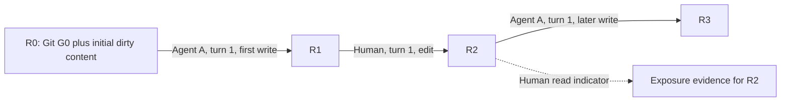

# Shared workspace history for human and agent edits

## Recommendation

Keep EditChain's Git-anchored work series, and back them with a shared history of
file revision occurrences. Present the two relationships distinctly: **who was
working in which session**, and **which file state an operation read, changed or
replaced**. Capture exact intermediate content wherever possible. Treat isolated
worktrees and coordinated writes as optional execution modes with stronger
guarantees, rather than prerequisites for measuring work.

The main issue is missing isolation and input-state provenance. Idempotent event
ingestion is a separate property: a repeated event must not change the result.
EditChain can have repeatable ingestion and projection even when one actor's
changes cannot be replayed independently of another actor's intermediate work.
This distinction follows the event-consumer contract described in Microsoft's
[Event Sourcing pattern](https://learn.microsoft.com/en-us/azure/architecture/patterns/event-sourcing)
and the local admission behavior described below.

This is a design recommendation. The cost and suitability assessments are
engineering judgments against the current repository, not measured comparative
benchmarks. It refines the earlier
[Git-anchored human-turn design](vscode-concurrent-work-graph.md).

## Pros and cons

The options operate at different layers and can be combined. In particular,
revision capture and checkpoints complement each other; a visualization change
does not itself coordinate writers.

| Approach | What the graph means | Pros | Cons and remaining limitations | Fit for EditChain |
| --- | --- | --- | --- | --- |
| **1. Keep work branches; clarify their meaning** | Git context plus session/turn continuity, explicitly labeled as shared work | Smallest presentation change; preserves current navigation, grouping and lane reuse; accurately describes activity | Does not recover intermediate state, establish independent replay, or fix attribution from incomplete diffs; labels alone leave dependencies hard to inspect | Useful immediate clarification; insufficient for the measurement goal by itself |
| **2. Show a shared workspace chronology** | Observed changes across actors appear in one sequence, with actor/session labels | Makes alternating human and agent work easy to follow; straightforward selected-file history; reduces the impression of isolated branches | Arrival order is not necessarily application order; multiple buffers and worktrees have different states; a single global chain can imply dependencies between unrelated files and obscure session continuity | Useful optional projection over retained evidence; do not make arrival order authoritative. See [Lamport](https://www.cs.cmu.edu/afs/cs.cmu.edu/academic/class/15712-s12/www/papers/lamport78.pdf) |
| **3. Work series plus shared file-revision provenance** | Session continuation and file-state transitions are related but distinct views | Represents current shared-worktree behavior; supports exact diffs, read indicators, interleaving and surviving-line origins; works for human/human, agent/agent and mixed activity | Requires revision occurrence identities, source reconciliation, explicit gaps and a second relationship layer; showing every dependency would clutter the graph | **Preferred foundation.** Moderate to substantial implementation, with reuse of `FileOp.base/after`, blobs and current projections. Modeling precedent: [W3C PROV](https://www.w3.org/TR/prov-dm/) |
| **4. Immutable checkpoints and an operation log** | Each recorded checkpoint has retained content and a recorded predecessor/context | Makes captured historical states inspectable; speeds replay; provides recovery points; content-addressed storage can share unchanged data | Boundary snapshots miss interleaved authorship and transient edits; copying a changing directory is not automatically an atomic snapshot; recording a snapshot does not make writers use it | Complement option 3 with sparse revisions and checkpoints. [Jujutsu](https://docs.jj-vcs.dev/latest/technical/concurrency/) is a useful repository-state precedent |
| **5. Actual isolated worktrees or snapshots per actor** | Each branch really has its own checkout state, followed by explicit integration | Clear file-state boundaries; competing implementations can be tested separately; later integration can be recorded explicitly | Changes the workflow; human corrections must be transferred to the relevant checkout; extra workspace/runtime management; no automatic isolation of shared services; branching only from Git omits pre-existing dirty edits unless carried explicitly | Conditional mode for independent experiments, not the default recorder. [Git worktrees](https://git-scm.com/docs/git-worktree) provide separate worktree files, HEAD and index |
| **6. Coordinate writes through a broker** | Accepted writes have validated input revisions; stale writes are rejected or explicitly reconciled | Can prevent participating writers from silently replacing newer edits; yields precise application receipts; can supply a reliable ordering boundary | Every protected writer must participate; checking then writing without an atomic boundary still races; whole-turn locks impede human work; validating a write target alone does not validate all prior reads | Optional later improvement for cooperating tools. Borrow the atomic comparison model from [etcd transactions](https://etcd.io/docs/v3.6/learning/api/), not an assumption that a database transaction protects arbitrary files |
| **7. CRDT or OT editing integration** | Operations on managed collaborative documents merge under the chosen algorithm | Strong convergence properties; fine-grained edit identities; useful for genuinely collaborative editor buffers and offline replicas | Requires editor/tool adapters and managed edit semantics; unmediated filesystem writes remain outside the protocol; converged text can still require conflict or semantic review; history retention is another requirement | Consider only if EditChain also becomes an editing/synchronization platform. [Yjs updates](https://docs.yjs.dev/api/document-updates), [Automerge conflicts](https://automerge.org/docs/reference/documents/conflicts/) |
| **8. Extract logical patches or virtual branches** | Shared edits are organized into reviewable changes with declared dependencies | Good for packaging mixed work into separate reviews; can retain dependencies below the commit level; supports selective inclusion | Assignment to a review branch is not proof of who authored/read the change; text dependencies do not establish build independence; overlapping writes can happen before packaging | Useful export/review layer. [GitButler parallel agents](https://docs.gitbutler.com/ai-agents/parallel-agents) and [Pijul's theory](https://pijul.org/manual/theory) address different parts of this problem |

## Scope and terminology

Information cutoff: **11 September 2026**. The local review covers the dirty
working tree based on commit `e5d9367db684214c91b8e5729947974d2224444a`, including
the current human-capture implementation. The extension declares VS Code
`^1.85.0`. Public references include current Git manuals, VS Code API docs,
Jujutsu and GitButler documentation, etcd 3.6, PostgreSQL 18, W3C Recommendations,
and original concurrency/collaborative-editing papers.

The decision concerns a recorder and visualization for cooperative developers.
Intentional typing remains an accepted human-work indicator. Reading remains
an indicator tied to displayed code. Window focus remains an in-memory dwell
guard, without a stored focus event. Automatic code merging, controlled agent
execution and runtime isolation are compared as alternatives, not assumed
requirements.

Four different guarantees need separate names:

| Guarantee | Meaning here |
| --- | --- |
| Idempotent admission | Delivering the same identified event again does not duplicate work or coverage |
| Deterministic projection | The same retained evidence, target and projection policy produce the same semantic rows, relationships, diffs and coverage |
| Historical reconstruction | The recorded revision can be retrieved or reconstructed with its known completeness |
| Independent execution/replay | One actor's work has all required inputs available without silently depending on another actor's unrecorded intermediate state |

Changing colors or drawing an extra branch cannot establish the last guarantee.
Even a retained source snapshot does not promise deterministic re-execution of
commands, tests or an AI model; environment and other inputs would also matter.
That stronger execution-replay problem is outside this proposal.

The evidence review used live discovery, original-source inspection, competing
approaches and targeted counterexamples. Multiple pages from one project are
treated as one evidence origin. The two collaborative-text papers cited below
share an author and are not counted as independent corroboration of each other.
No comparative EditChain latency, storage or usability benchmark was performed.

## What the current projection actually records

The extension renders a Rust/WASM History surface backed by native projections:

```text
source occurrences and normalized operations
  -> session/turn semantics and explicit Git relationships
  -> Activity grouping or retained live items
  -> visible parents and lane geometry
  -> History rows, expanded file details and recorded VS Code diffs
```

| Local component | Observed behavior | Consequence |
| --- | --- | --- |
| [Codex Git anchoring](../crates/editchain-import/src/codex/session_git.rs) | Records `BasedOn` from exact session-start Git metadata | Establishes Git context; does not capture dirty files or an isolated snapshot |
| [History parents](../crates/editchain-project/src/node.rs) | Combines source ancestry, explicit Git relationships and structural notes; inherits links through contraction | Existing branches are projected work relationships, not proof of independent state |
| [Activity grouping](../crates/editchain-project/src/activity.rs) | Groups adjacent operations on one parent path and protects fan-in/fan-out endpoints | Preserve this discipline when adding state dependencies; do not collapse a whole interleaved turn indiscriminately |
| [Editor admission](../crates/editchain-node/src/editor.rs) | Uses stable session/sequence identities, accepts exact replays, rejects conflicting identity reuse; emits unscoped raw imports | Ingestion already distinguishes duplicates; human session/turn semantics and Git anchors are still missing |
| [Core file operations](../crates/editchain-core/src/op.rs) | Has before/after content IDs and observed/proposed/applied/saved/deleted stages | Reusable storage foundation, but content IDs alone are not revision-occurrence identities |
| [File diffs](../crates/editchain-node/src/history/files.rs) | Prefers retained sides when present; some legacy previews reconstruct against a Git baseline or show partial hunks | Complete shared intermediate state is not available for every historical agent edit |
| [Human coverage](../crates/editchain-node/src/history/human_work.rs) | Orders observations by time/ID and overlays AI evidence through timestamp filtering and text alignment | Coverage is not yet joined through a common exact revision-occurrence index; alignment strength must remain explicit |
| [Live Git tracker](../crates/editchain-node/src/history/realtime/git.rs) | Tracks refs, HEAD and commits, with an early exit when they have not changed | Unchanged Git HEAD does not mean an unchanged workspace |
| [History presentation](../crates/editchain-node/src/history/presentation.rs) | Expanded child rows currently have empty parent relationships | Fixing disconnected dots addresses presentation, but does not establish shared-state provenance |
| [Protocol relationships](../crates/editchain-protocol/src/lib.rs) | Structural kinds include subagent, reconnect, fork and produced commit; file sources are Git, Agent and Unknown | File lineage/read evidence needs deliberate representation; human file changes need an explicit source path |

These are source-code findings, not evidence that every concurrent scenario has
already failed. In particular, a conceptual dependence between actors is not
itself an idempotency defect in the stored event set.

## Findings that change the design

### Work continuity and state use answer different questions

W3C PROV separates entities with fixed aspects from activities that take place
over time, with distinct usage, generation and derivation relationships. It also
warns that using an entity during an activity does not by itself prove every
output was derived from that entity. This is a useful vocabulary for separating
turn membership from content lineage. [PROV-DM, sections 2.1 and 5.1](https://www.w3.org/TR/prov-dm/)

For EditChain, a turn is a work interval, while each observed file revision is a
specific occurrence. A turn can read different revisions at different times.
The proposal should not assign a fictional frozen workspace to every operation
merely because the turn has one Git anchor.

A shared history can look like this, while all operations remain associated
with their original Git-anchored work series:



The arrows above describe a constructed, fully observed single-file example,
not a claim that all repository files share one atomic version counter.

### A whole turn is not an atomic graph node

Consider the operation path `A1.write1 -> H1.write1 -> A1.write2`. It is acyclic.
If both A1 operations are contracted into a single node while preserving the
cross-actor dependencies, the result contains `A1 -> H1 -> A1`.

This is a mathematical counterexample to naive grouping, not a causal cycle in
what actually happened. Preserve operation endpoints or contiguous fragments
with the same semantic turn ID. Alternatively, show the turn as an interval
with dependency links attached to its internal events. Do not feed every
whole-turn dependency into a layout that expects an acyclic parent graph.

The distinction between interval relationships and event precedence also fits
the event-ordering validation used by
[PROV Constraints](https://www.w3.org/TR/prov-constraints/). The precise
counterexample above was checked independently as a small constructed model.

### Content equality is not revision identity

A file can evolve `X -> Y -> X`. The first and last occurrences have equal
bytes but different histories. Using only content hashes as history nodes
would collapse this into `X -> Y -> X`, creating another artificial cycle and
potentially transferring old review credit to newly introduced text.

Retain distinct occurrence IDs pointing to shared content blobs. A concrete
precedent is Pijul's use of introducing-change identity plus position to
distinguish identical lines introduced by different changes. Its text-level
dependencies also do not claim to capture all semantic dependencies.
[Pijul theory](https://pijul.org/manual/theory)

Deduplicate blob bytes freely. Deduplicate events by stable event identity.
Reconcile two observations of one modification only with adequate occurrence
evidence; equal path/before/after hashes alone do not prove they are one event.
An explicit undo can restore lineage through its recorded relationship; equal
text alone should not silently establish that relationship.

### The agent's read revision may differ from its application base

Suppose an agent reads R0, a human produces R1, and the agent later writes R2
using its earlier R0 context. The actual application transition is R1 to R2,
but the agent's observed input was R0. Recording only R1 as the agent's input
would falsely imply it incorporated or inspected the human change.

Keep both the **read/context revision**, when observed, and the **actual
before/after application revisions**. A before-content ID identifies what was
changed or replaced; it does not establish what the model saw. Detect and label
the stale context when evidence supports it, without pretending that recording
the overwrite prevented it.

Similarly, an agent turn's initial-to-final workspace diff can include a human
edit to another file. Aggregate the agent's own file operations for authorship;
retain whole-workspace changes as context with their separate meaning.

### Ordered storage does not establish isolated execution

Lamport's original result distinguishes causal partial order from a compatible
total ordering. For this recorder, an ingestion sequence is an observation
order; it is not automatically the application order of separately captured
changes. Source sequences and explicit revision dependencies carry stronger
evidence than cross-source timestamp sorting.
[Lamport, 1978, sections on partial and total ordering](https://www.cs.cmu.edu/afs/cs.cmu.edu/academic/class/15712-s12/www/papers/lamport78.pdf)

Keep event collection immutable and let relationships resolve when delayed
evidence arrives. Deterministic display tie-breakers may order incomparable
events without asserting a causal edge. Reprojection must tolerate missing
predecessors and distinguish unresolved state from proven independence.

Database isolation is a useful analogy with a clear boundary: PostgreSQL
distinguishes repeatable snapshots from serializable transactions, and its
Repeatable Read level can still permit serialization anomalies. A snapshot
feature alone is therefore insufficient grounds to claim that whole coding
turns behave like isolated serial transactions.
[PostgreSQL 18 transaction isolation](https://www.postgresql.org/docs/current/transaction-iso.html)

### Recording is bounded by what the sources expose

The VS Code API exposes document changes, ranges, replacement text and document
versions; versions increase through undo/redo. Its change-reason enum identifies
undo/redo, without a universal human/agent/process identity. File watcher events
carry a URI rather than exact content transitions. These APIs support capture,
but do not alone provide a complete transaction journal for all external tools.
[VS Code API: document changes, versions and watchers](https://code.visualstudio.com/api/references/vscode-api)

Preserve separate repository/worktree, index, disk and editor-buffer identities.
Use capture gaps and partial-lineage status where evidence is missing. Initial
unstaged content may be retained without assigning an author. Cooperative
typing evidence can establish a human-edit indicator without solving every
cross-source attribution problem.

## Lessons from the alternatives

**GitButler supports the shared-workspace premise.** Its parallel-agent guide
explicitly distinguishes shared files/runtime from separate worktrees and calls
out accidental dependencies. This is a strong precedent for keeping useful
work lanes without promising isolation.
[GitButler parallel agents](https://docs.gitbutler.com/ai-agents/parallel-agents)

Its virtual-branch page describes extracting branches from a combined working
directory. That packaging claim should not be generalized into independent
runtime behavior: a repository discussion also acknowledges races when editing
overlapping areas. These are related first-party sources, not independent
corroboration. [Parallel branches](https://docs.gitbutler.com/features/branch-management/virtual-branches),
[repository discussion, 5 February 2026](https://github.com/gitbutlerapp/gitbutler/discussions/12228)

**Jujutsu demonstrates immutable repository-operation views.** Its operation
log retains view objects and operation parents, and can merge divergent
repository operations. Its working-copy documentation describes snapshotting
around commands. That is a useful architectural precedent, but is not evidence
of capturing every keystroke or every file version between commands.
[Concurrency](https://docs.jj-vcs.dev/latest/technical/concurrency/),
[working copy](https://docs.jj-vcs.dev/latest/working-copy/)

**Coordination requires a real enforcement boundary.** etcd atomically evaluates
comparisons and applies the selected transaction block. The relevant lesson is
atomic revision validation and mutation. For EditChain, an optional broker
would need all protected writers to use its boundary; wrapping an ordinary
filesystem write in an unrelated metadata transaction would not supply that
guarantee. [etcd 3.6 transaction API](https://etcd.io/docs/v3.6/learning/api/)

**CRDTs provide real guarantees, with a different scope.** Yjs documents
order-independent and duplicate-safe update application. Automerge retains
competing values for conflicting property writes. These are meaningful managed
document guarantees, rather than universal elimination of application-level
conflicts. [Yjs updates](https://docs.yjs.dev/api/document-updates),
[Automerge conflicts](https://automerge.org/docs/reference/documents/conflicts/)

The 2019 interleaving paper identifies weaknesses in particular text algorithms;
the later Fugue work proves a stronger non-interleaving property for FugueMax.
It would be wrong to use the older paper to claim all current CRDT libraries
have the same flaw. The relevant lesson is to specify the required text and
semantic behavior before choosing an algorithm.
[Interleaving anomalies, 2019](https://martin.kleppmann.com/papers/interleaving-papoc19.pdf),
[Fugue, version 3, 21 October 2025](https://arxiv.org/html/2305.00583v3)

## Proposed integration and visual behavior

The following is a proposed design, not an implemented schema or UI contract.

### Capture boundaries and external environment drift

Revision capture must be workspace-centered. Agent lifecycle events are one
input; they cannot define the complete universe of changes. Other editors,
formatters, Git commands, generators, unrelated processes and background jobs
can change files while an agent runs or after its tool call returns. A
post-tool snapshot records observed content at capture time, without proving
that the tool caused every difference or read that content earlier.

The current [Codex bridge](../tools/codex-session-exporter/README.md) reads rollout
records, and its final session snapshot summarizes those records. It is not a
snapshot of the filesystem. As of this report's cutoff, Codex documents
`PreToolUse` and `PostToolUse` hooks for supported local tools, including shell,
patch and MCP paths, with coverage exceptions. These are potential capture
triggers and attribution inputs; their applicability needs verification against
the deployed Codex version. [Codex hooks](https://learn.chatgpt.com/docs/hooks)

The app-server also documents file-change items and an `fs/watch` API that emits
changed paths for UI invalidation. That contract does not provide exact
before/after bytes or writer identity for every external change.
[Codex app-server filesystem and event APIs](https://learn.chatgpt.com/docs/app-server)

Use independent disk/index observation and reconciliation alongside VS Code
buffer events. Reconciliation runs at startup, after gaps, on file-change hints
and at selected activity boundaries; periodic checks can detect changes missed
by hints. It remains possible to miss an intermediate write, including a file
changing and returning to its previous bytes between observations. Repeated
scans do not establish an atomic workspace snapshot or a complete write log.

| Observation | What may be claimed | What remains unresolved |
| --- | --- | --- |
| Exact buffer change plus human-input evidence | Recorded buffer transition and human-edit indicator | Any distinct disk/runtime state |
| Instrumented producer operation with exact applied sides | Attributed transition within the instrumented boundary | Unobserved reads and effects outside that boundary |
| Two retained snapshots with intervening external activity | Exact retained endpoints and their net difference | Intermediate revisions, writers and application order |
| Known buffer R2 while disk is R1 | Reading evidence for the displayed R2 | Reading or reviewing R1 does not follow automatically |
| Changed compiler, dependencies, database or remote service | Only captured environment facts, if any | Runtime reproducibility cannot be inferred from code snapshots |

A revision record therefore needs observation source, capture time/sequence,
content identity, layer and scope, independently from authorship and transition
completeness. Unknown authorship does not imply unknown endpoint bytes. When
the observed file no longer matches the tracked predecessor, append a
reconciliation fact retaining the newly observed revision and mark the
intervening lineage unresolved. Preserve both known endpoints without inventing
a continuous actor-attributed edit chain. Use an external/unattributed change
marker in file history, rather than attaching every such change to the active
agent or human session.

For human read/edit measurement, prioritize source content, Git/index context,
buffer identity and line origins. Environment drift can affect whether a test
result still applies; recording relevant environment fingerprints would be a
separate capability. It is not necessary to reconstruct every environmental
input merely to establish that particular recorded code was displayed or edited.
The product guarantee should be repeatable queries over retained evidence, with
explicit limits on lineage, rather than complete replay of an open environment.

### Projection steps

1. **Retain the existing work graph.** Human recordings gain session and turn
   semantics and captured Git anchors, using the same projection as agents.
   Label shared worktree context clearly. Preserve current lane reuse, agent
   spawn/fork relationships and stable identities.
2. **Add revision occurrences below work activities.** Each occurrence identifies
   its repository/worktree, file/buffer incarnation, content reference and
   supporting source occurrences. Applied changes refer to actual before/after
   occurrences; reads and exposures refer to what was observed. Unknown context
   remains representable.
3. **Keep relationship meanings distinct.** Git ancestry, session continuation,
   input observation, content transition and evidence corroboration are not
   interchangeable `parents`. Resolve the file relationships in the shared
   projection layer, then expose them to batch and live clients consistently.
4. **Show detail on selection.** The default History view keeps work series
   readable. Selecting a turn or file reveals intermediate revisions, exact
   recorded diffs, human read/edit indicators and relevant cross-actor state
   links. Supporting observation records do not each need an activity dot.
   Text labels explain edge meanings; color alone is insufficient.
5. **Preserve interleaved fragments.** Expand graph-bearing operations with real
   endpoints. A semantic turn may appear in multiple contiguous fragments;
   selection and summary should still identify it as one turn. File provenance
   should not force a false whole-turn DAG or an invented Git merge.
6. **Use checkpoints as an accelerator.** Build sparse content-addressed state
   indexes and occasional checkpoints from captured revisions. Mark their
   completeness. Do not label a multi-file observation set atomic without an
   actual capture guarantee.
7. **Join coverage to the same lineage.** Give the file graph, recorded diffs
   and human-work report one source of revision identity and attribution.
   Keep a confidence/status distinction for legacy text-aligned evidence.

For optional coordinated writes, distinguish validating a target revision from
validating all dependencies that a tool read. A stale-write guard can help with
the first without proving whole-turn serializability. Avoid locking out the
human for an entire agent turn.

For actual isolated worktrees, record their real identities and explicit
integration operations. Worktree separation is a fact to capture when present,
not something to infer from actor labels or different session IDs.

## Consequences for human-review measurement

The report needs an explicit target: a selected commit, captured disk revision
set, or editor-buffer revision. Reading one buffer should not automatically
mark a different disk version as read. A normal Git commit records staged
content, which can differ from newer working-tree content; the recorded commit
tree is authoritative even when command options prepare its contents in other
ways. [Git commit documentation](https://git-scm.com/docs/git-commit)

For the selected target, retain separate measures:

- AI-origin content that survives in that target;
- surviving AI-origin content with human read indicators;
- surviving AI-origin content with human-edit ancestry, under a declared policy
  for replacements and mixed lines;
- historical AI-origin content that was human edited and subsequently removed;
- content whose origin or review lineage remains unknown.

Read and edit sets can overlap. Their union measures content with either kind
of human interaction; summing them would double-count. Use distinct historical
and current-content views so a deleted reviewed line does not inflate review
coverage of today's code, while the human work remains recorded.

Carry review evidence through proven unchanged lineage. After new AI content is
introduced, do not inherit review credit simply because the same pathname,
line number or text appeared earlier. An observed overwrite preserves evidence
that human work happened while updating what survives in the selected target.
None of these quantities follows from counting human graph nodes alone.

## Evidence map

| Major claim | Best direct evidence | Independent corroboration or check | Assessment |
| --- | --- | --- | --- |
| Shared work branches do not establish isolated file state | [GitButler's explicit shared-state description](https://docs.gitbutler.com/ai-agents/parallel-agents) | [Git's separate-worktree contract](https://git-scm.com/docs/git-worktree); local `BasedOn` importer | High confidence for the distinction |
| Duplicate-safe projection and execution isolation are different properties | [Event Sourcing's idempotent-consumer requirement](https://learn.microsoft.com/en-us/azure/architecture/patterns/event-sourcing) | Local admission code; constructed duplicate-delivery check | High confidence; no claim of universal existing projection correctness |
| Work activities and used/generated revisions need distinct semantics | [PROV-DM](https://www.w3.org/TR/prov-dm/) | Local `FileOp`/session structure and worked shared-state example | High confidence in the modeling distinction; UI preference remains a judgment |
| Whole-turn contraction can introduce a cycle | Constructed `A1.write1 -> H1.write1 -> A1.write2` counterexample | Existing Activity grouping protects adjacent paths and branch endpoints | High confidence for the counterexample; not an observed production failure of this exact scenario |
| Equal content does not establish equal lineage | [Pijul introducing-change identity](https://pijul.org/manual/theory) | Constructed `X -> Y -> X` example; VS Code version behavior | High confidence |
| Snapshots alone do not establish serial execution | [PostgreSQL isolation distinctions](https://www.postgresql.org/docs/current/transaction-iso.html) | [Jujutsu's separate repository view and working-copy steps](https://docs.jj-vcs.dev/latest/working-copy/) | High confidence in the distinction; filesystem design application is an inference |
| CRDT convergence has a narrower scope than desired code semantics | [Yjs update contract](https://docs.yjs.dev/api/document-updates) | [Automerge explicit conflicts](https://automerge.org/docs/reference/documents/conflicts/); [Fugue's stronger text specification](https://arxiv.org/html/2305.00583v3) | High confidence for the scoped claim; algorithm choice needs its own evaluation |
| Atomic stale-write prevention needs participating writers | [etcd transaction comparisons](https://etcd.io/docs/v3.6/learning/api/) | PostgreSQL controlled transaction model; read/application counterexample | High confidence for the primitive; integration cost is unmeasured |
| A shared revision index is the best near-term fit | Current projection/storage reuse and the findings above | No comparative EditChain usability or performance study | Medium confidence; recommendation rather than measured superiority |

## Validation and unresolved questions

Five constructed model checks passed:

| Check | Result |
| --- | --- |
| Interleaved operation path versus whole-turn contraction | Operation graph acyclic; contracted A1/H1 graph cyclic |
| Revision occurrences versus content-hash nodes for `X -> Y -> X` | Occurrence graph acyclic; hash-only graph cyclic |
| Workspace delta versus actor-owned changes | Combined delta includes two changed files; agent changed only one |
| Stale read versus actual overwritten revision | Read R0 differs from application-before R1 |
| Stable occurrence identities with dependency-aware replay | All six delivery permutations of three events, each delivered twice, yield the same event sequence |

These validate the examples and counterexamples. They are not EditChain
integration tests, concurrency benchmarks, or proof that the proposed UI is
implemented. Machine-readable results are retained in
[model-checks.json](../outputs/vscode-capture/shared-workspace-research/model-checks.json).

The most valuable next implementation experiment is one real dirty worktree
with two agent sessions and one human recorder. Start with staged, unstaged and
untracked content. Interleave edits within one long turn; let another agent
write from a stale read; let a human view a buffer differing from disk; deliver
one source late; partially commit; reopen the History view. Compare historical
and live semantic identities, relationship meanings, exact diff sides and
coverage sets. Include identical reintroduced text and an explicit undo.

Unresolved issues are capture completeness for arbitrary external writes,
cross-source occurrence matching, multi-file atomicity, legacy attribution
confidence, turn-boundary UX and the policy for AI-derived human replacements.
Measure capture overhead and storage on that workload before choosing checkpoint
frequency. No evidence here supports a specific performance or storage estimate.

The recommendation changes if the product's goal becomes preventing interference
rather than observing it. Enforced worktrees are stronger for competing isolated
attempts; coordinated editing is stronger when every writer can participate.
For the current measurement goal, incomplete observation should produce explicit
unknown lineage instead of changing the developer's workflow by default.

## Principal sources

All links below were inspected as of the cutoff. Project documentation without
a visible publication date is identified as current documentation rather than
assigned an invented date.

| Source | Publication/version | Role |
| --- | --- | --- |
| [Git: git-worktree](https://git-scm.com/docs/git-worktree) | Manual last changed in 2.54.0, 20 April 2026 | Actual checkout, HEAD and index separation |
| [Git: git-commit](https://git-scm.com/docs/git-commit) | Manual last changed in 2.55.0, 29 June 2026 | Committed content and index semantics |
| [GitButler: Parallel agents](https://docs.gitbutler.com/ai-agents/parallel-agents) | Current documentation | Closest shared-workspace comparison |
| [GitButler: Parallel branches](https://docs.gitbutler.com/features/branch-management/virtual-branches) | Current documentation | Logical change packaging |
| [GitButler discussion 12228](https://github.com/gitbutlerapp/gitbutler/discussions/12228) | 5 February 2026 | First-party repository discussion of overlap; same origin as GitButler docs |
| [Jujutsu: Concurrency](https://docs.jj-vcs.dev/latest/technical/concurrency/) | Current documentation | Immutable repository-operation views |
| [Jujutsu: Working copy](https://docs.jj-vcs.dev/latest/working-copy/) | Current documentation | Command-boundary capture and stale copies |
| [W3C: PROV-DM](https://www.w3.org/TR/prov-dm/) | Recommendation, 30 April 2013 | Activity, entity, usage and derivation |
| [W3C: PROV Constraints](https://www.w3.org/TR/prov-constraints/) | Recommendation, 30 April 2013 | Event ordering; same standards family as PROV-DM |
| [Leslie Lamport: Time, Clocks, and the Ordering of Events in a Distributed System](https://www.cs.cmu.edu/afs/cs.cmu.edu/academic/class/15712-s12/www/papers/lamport78.pdf) | CACM, July 1978; original paper hosted by CMU | Partial and total order; bibliographic identity cross-checked with [Microsoft Research](https://www.microsoft.com/en-us/research/publication/time-clocks-ordering-events-distributed-system/) |
| [Microsoft: Event Sourcing pattern](https://learn.microsoft.com/en-us/azure/architecture/patterns/event-sourcing) | Current architecture documentation | Event identity, replay and projections |
| [Microsoft: VS Code API](https://code.visualstudio.com/api/references/vscode-api) | Current extension API reference | Document revisions, change events and filesystem notifications |
| [etcd: API](https://etcd.io/docs/v3.6/learning/api/) | Version 3.6 | Atomic comparisons and transactions |
| [PostgreSQL: Transaction Isolation](https://www.postgresql.org/docs/current/transaction-iso.html) | Version 18 | Snapshot versus serializable behavior |
| [Yjs: Document Updates](https://docs.yjs.dev/api/document-updates) | Current documentation | Update convergence and duplicate application |
| [Automerge: Conflicts](https://automerge.org/docs/reference/documents/conflicts/) | Current documentation | Explicit conflicts under convergent replication |
| [Pijul: Theory](https://pijul.org/manual/theory) | Current manual | Change identity and text dependencies |
| [Kleppmann et al.: Interleaving anomalies in collaborative text editors](https://martin.kleppmann.com/papers/interleaving-papoc19.pdf) | PaPoC 2019 | Algorithm-specific counterexamples |
| [Weidner and Kleppmann: The Art of the Fugue](https://arxiv.org/html/2305.00583v3) | Version 3, 21 October 2025; TPDS November 2025 | Stronger non-interleaving specification and proof |
