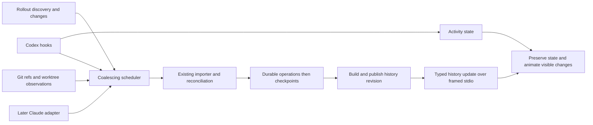

# Realtime Git and coding-agent integration for EditChain

This document records the investigation before the realtime refactor. The
[implementation and verification notes](docs/realtime-deltas.md) describe the
completed Codex/Git delta pipeline, benchmarks, actual-session recording, and
remaining provider boundaries. Repository gap descriptions below refer to the
inspected baseline.

EditChain should observe normally launched Codex sessions and preserve the existing durable import semantics while introducing a retained, incremental processing path. Realtime mode must support `+1 op` changes through admission, projection, layout, transport and rendering after an initial load. Animated snapshot replacement validates interaction behavior but does not fulfill realtime processing. The [operation-delta contract](docs/realtime-deltas.md) records this requirement and the implementation gaps. Codex hooks can supply prompt activity signals and wake the importer; a versioned transcript adapter remains useful for discovery and recovery. A Codex app-server connection is a separate option when EditChain manages the session or can connect to its known runtime.

The main implementation gap is between capture and presentation. EditChain already handles growing sources, immutable revisions, and replay. It currently presents a fixed history snapshot, and refreshing that snapshot clears selection and expansion. Realtime mode therefore needs coordinated ingestion, snapshot publication, and stable visual identity; installing a hook alone will not deliver it.

This assessment is current as of **2026-09-11**. EditChain was inspected at `e5d9367db684214c91b8e5729947974d2224444a`. The installed executable reports **`codex-cli 0.154.0-alpha.11`**, with `hooks` reported as `stable` and enabled. Its app-server JSON schemas were inspected using `codex app-server generate-json-schema --out <temporary-directory>`, without starting a model session. The sibling Codex source checkout is `4d3d1c2cdca618e410b04783aa6188b7599c8381`; source observations from that checkout are distinguished from installed-binary evidence. Claude findings come from current official documentation, not a local Claude execution test.

The working scope is passive observation of local CLI and IDE sessions, followed by Claude Code support. “Sync” here covers source-to-store and store-to-extension updates. Network replication is a separate concern: this checkout's [workspace manifest](/mnt/hot/ambientlight/repos/editchain/Cargo.toml:1) contains no replication crate. The existing multiplayer research note remains separate.

The evidence includes official provider documentation, Git and Node.js manuals, two integration projects' own descriptions, generated Codex schemas, and local implementation review. Searches included counterexamples involving missing IDE hooks, transcript lag, watcher replacement behavior, and whether resume is equivalent to passive attachment. Provider documentation and provider source code are one evidence origin, not independent corroborators. The architecture below is a recommendation; its latency and end-to-end behavior have not been benchmarked.

The available integration points differ chiefly in session ownership and the evidence they carry.

| Integration point | Evidence available | Fit for EditChain |
|---|---|---|
| Codex lifecycle hooks | Tool and conversation boundaries; session, turn, tool, and working-directory context | Preferred activity/wakeup adapter for configured passive sessions. [Hooks](https://learn.chatgpt.com/docs/hooks) |
| Codex app-server | Structured thread/turn/item notifications, file-change items, turn diffs | Rich client integration for managed sessions or a known shared runtime. [App-server](https://learn.chatgpt.com/docs/app-server) |
| `codex exec --json` | JSONL events from the execution being launched | Useful for an EditChain-owned subprocess, rather than attaching to an unrelated process. [Non-interactive mode](https://learn.chatgpt.com/docs/non-interactive-mode) |
| Codex SDK | Application-controlled thread execution and continuation | Consider if EditChain gains a run/continue interface. [SDK](https://learn.chatgpt.com/docs/codex-sdk) |
| Provider transcript/rollout files | Persisted session evidence as records become available | Reuse for import, recovery, and existing-session discovery; maintain version compatibility. [Codex hooks](https://learn.chatgpt.com/docs/hooks), [Claude sessions](https://code.claude.com/docs/en/sessions.md) |
| Claude Code hooks and headless stream | Lifecycle callbacks; JSON streaming for launched runs | Later provider adapter; preserve provider-specific event semantics. [Hooks](https://code.claude.com/docs/en/hooks.md), [Programmatic execution](https://code.claude.com/docs/en/headless.md) |
| Filesystem notifications and Git inspection | Observed file, index, ref, and commit state | Independent reconciliation path. Git hooks occur at Git execution boundaries, so ordinary writes need separate observation. [Git hooks](https://git-scm.com/docs/githooks) |

Codex's documented hooks cover `PreToolUse` and `PostToolUse` for `apply_patch`, shell execution, and other supported local tools. Shell matching uses `Bash`, including unified execution; its completion may arrive through a later poll. Command hooks can run asynchronously. Hook definitions require trust, and the transcript format is explicitly described as unstable. These facts support a capability-aware adapter rather than reliance on the old end-of-turn `notify` mechanism. [Codex hooks](https://learn.chatgpt.com/docs/hooks)

The installed schema exposes twelve hook event kinds: pre/post tool use, permission request, pre/post compaction, session start/end, prompt submission, child-agent start/stop, stop, and interrupt. It does **not** expose Claude's separate `PostToolUseFailure` or `FileChanged` names in that enum. The sibling source independently exposes the same twelve-name set and a post-tool payload containing `session_id`, `turn_id`, optional agent identifiers, `transcript_path`, `cwd`, `tool_name`, `tool_input`, `tool_response`, and `tool_use_id`. This establishes a useful mapping surface, but is not a runtime test of every hook in every Codex client. [Hook names](/mnt/hot/ambientlight/repos/codex/codex-rs/hooks/src/lib.rs:22), [payload definition](/mnt/hot/ambientlight/repos/codex/codex-rs/hooks/src/schema.rs:323)

For the initial adapter, use start/prompt/pre-tool signals to show activity and post-tool/stop/interrupt signals to request reconciliation. Keep child-agent identities separate from parent session identities. Interpret stop as a turn boundary, not permanent session completion. Use explicit tool results to distinguish success from failure; a failed command may already have changed files.

App-server deserves a narrow, accurate claim. `thread/read` reads stored state without subscribing; start/resume establishes the documented event flow. Current documentation directs clients toward `fileChange` items and `turn/diff/updated`, and says the legacy file-change output-delta notification is no longer emitted. WebSocket support is marked experimental. [App-server documentation](https://learn.chatgpt.com/docs/app-server)

The installed CLI also exposes `app-server daemon` and `app-server proxy`, and its generated protocol contains `thread/loaded/list`, `thread/read`, `thread/resume`, and `thread/unsubscribe`, but no standalone `thread/subscribe` request. A legacy notification can remain in a generated schema even when current documentation says it is not emitted; schema presence alone is not a delivery guarantee. The sibling implementation can rejoin a thread already in its thread manager and register a connection listener. When it does not find that runtime, it takes a stored-history resume path. This supports a shared-runtime experiment, not a claim that a newly launched server can tap any independently running CLI or IDE process. [Resume implementation](/mnt/hot/ambientlight/repos/codex/codex-rs/app-server/src/request_processors/thread_processor.rs:4256), [listener registration](/mnt/hot/ambientlight/repos/codex/codex-rs/app-server/src/request_processors/thread_lifecycle.rs:140)

Accordingly, the passive implementation should not call resume merely to inspect history. A future shared-runtime adapter should first establish which server owns the thread, its supported schema, and the effects of joining and disconnecting. It must preserve the existing client's control of execution and approvals. Durable recovery still needs stored evidence; no replay-from-notification-sequence contract was established by this investigation.

MCP and telemetry are useful adjacent surfaces. MCP exposes tools and context to Codex; registering an EditChain tool does not establish a subscription to all other tool calls. Explicit hooks can invoke an integration instead. Codex's OpenTelemetry export includes run and tool-related events, but exporters batch asynchronously. I would use it for diagnostics and correlation, while retaining file/session evidence for the history projection. [MCP](https://learn.chatgpt.com/docs/extend/mcp), [Telemetry](https://learn.chatgpt.com/docs/config-file/config-advanced)

Two inspected projects demonstrate a recurring architecture, without establishing market-wide prevalence. Entire combines captured sessions with work-in-progress checkpoints and links permanent checkpoints to commits; it documents independent worktree session tracking. Git AI describes agent-triggered checkpoints and commit-associated Git Notes for attribution. Both separate agent evidence from the final Git commit relationship. EditChain can adopt that separation while keeping its own operation store. [Entire's implementation overview](https://github.com/entireio/cli#how-it-works), [Git AI](https://github.com/git-ai-project/git-ai)

The repository already supplies much of the capture foundation.

| Layer | Existing behavior | Consequence for live mode |
|---|---|---|
| Source capture | Captures a source copy; verifies the accepted prefix; distinguishes unchanged, append, and rewritten sources; excludes incomplete trailing records | Reuse this instead of introducing an unrelated tailing cursor. [Source read plan](/mnt/hot/ambientlight/repos/editchain/crates/editchain-import/src/source_read.rs:165) |
| Durable import | Reserves source identities, appends operations durably, then commits checkpoints; exact replay is deduplicated | Preserve this ordering. It is replay-safe sequencing, not a single atomic transaction. [Batch persistence](/mnt/hot/ambientlight/repos/editchain/crates/editchain-import/src/batch.rs:128) |
| Logical item revisions | Later occurrences carry upserts with thread, turn, item, incarnation, and current output IDs | Tool completion can extend a session without mutating prior evidence. [Materialization](/mnt/hot/ambientlight/repos/editchain/crates/editchain-project/src/materialization.rs:15) |
| Codex projection | Invokes the exporter on the whole captured file, including incremental imports | Cursor support does not make current processing cost proportional to the appended bytes. [Importer](/mnt/hot/ambientlight/repos/editchain/crates/editchain-import/src/codex/import.rs:244) |
| History service | `Open`/`Refresh` establish a fixed snapshot; explicit refresh bypasses the render cache | Add scheduled publication and later incremental projection. [Workspace opening](/mnt/hot/ambientlight/repos/editchain/crates/editchain-node/src/history/mod.rs:290) |
| Staleness | Source-reading requests can fail after changes; window paging and searches of an already-built index retain pinned data | Coordinate revisions instead of removing stale-snapshot checks. [Dispatch](/mnt/hot/ambientlight/repos/editchain/crates/editchain-node/src/transport.rs:38) |
| Service transport | Framed stdio requests/responses; the TypeScript host can forward unsolicited frames, but the Rust response has a required numeric ID and the renderer rejects a missing ID | Push needs an explicit event envelope and compatible consumers. [Protocol](/mnt/hot/ambientlight/repos/editchain/crates/editchain-protocol/src/lib.rs:48), [renderer parsing](/mnt/hot/ambientlight/repos/editchain/crates/editchain-history-renderer/src/app/host.rs:35) |
| Renderer refresh | Clears selection, expansion, pending requests, and row cache on a successful open | Add a live-update transition that retains user state. [Open handling](/mnt/hot/ambientlight/repos/editchain/crates/editchain-history-renderer/src/app/state.rs:1094) |

Two identity rules are especially important. First, the same operation ID with different bytes is a conflict whose variants are retained but excluded from the accepted view. Reusing a pending operation ID with a completed payload would violate the store's semantics. Second, current visual node keys are based on operation or bundle-anchor IDs, whereas the materializer already has a richer logical item identity. The renderer should receive a stable presentation key derived from source generation, owning thread, turn, item, and incarnation, together with the current operation ID used for details. [Admission](/mnt/hot/ambientlight/repos/editchain/crates/editchain-core/src/admission.rs:11), [logical upserts](/mnt/hot/ambientlight/repos/editchain/crates/editchain-project/src/materialization.rs:307), [node keys](/mnt/hot/ambientlight/repos/editchain/crates/editchain-project/src/node.rs:313)

Existing Git commits use repository-qualified object identities. Keep those stable. A source append can still change grouping, ordering, or lane placement in the derived view; deterministic layout within one snapshot is not proof that old lanes remain fixed across revisions. That stability needs explicit design and testing.

The proposed flow keeps fast activity separate from accepted history:

All names in this diagram and the following contract are proposed EditChain concepts, not existing provider APIs.

| Proposed signal | Meaning | Persistence/presentation rule |
|---|---|---|
| `ActivityObserved` | A session/tool started, stopped, waited, or failed | May update a badge before history is imported; show capture status separately |
| `SourceDirty` | A source might contain new evidence | Scheduling hint; not proof of an edit or commit |
| `ImportCommitted` | A batch's operations were durably accepted | Carries accepted source/checkpoint information and affected identities |
| `HistoryChanged` | A coherent new view revision is available | Carries base/new view revision and affected sessions/rows, or requests a replacement snapshot |
| `ResyncRequired` | The receiver cannot apply an update to its current revision | Fetch a fresh baseline; do not guess missing patches |

Keep three notions of progress distinct: provider position, accepted store progress, and published view revision. A physical source cursor cannot serve as a global UI sequence across multiple files. Likewise, a current activity badge does not imply all associated file evidence has been persisted. Initially, hooks should be hints and an activity overlay, while the current importer remains the canonical operation producer. This avoids creating two independently numbered durable histories for the same tool call.

Use one ingestion coordinator per chain, or explicit ownership across extension windows. Coalesce repeated notifications by source, serialize imports through the existing writer lock, and keep a dirty flag if another change arrives during work. Apply the same discipline to refresh: one build in flight and one pending follow-up. A hook should do only bounded local delivery or spooling; it should not synchronously rebuild the entire history. If stronger capture guarantees require a short synchronous enqueue, measure its cost separately from background import work.

Watchers are invalidation hints. Reconcile at startup, after reconnect, and periodically during active use. Re-register watches after file replacement and rediscover sources when needed. Node's documented watcher behavior illustrates why: deleting and recreating a watched path can leave the watcher on the old inode, and a callback filename is not guaranteed. These are design constraints even if the eventual watcher uses a different library. [Filesystem watcher caveats](https://nodejs.org/api/fs.html#caveats)

Do not replace the importer's captured-source protocol with an unverified live file handle. Preserve incomplete-record buffering, source-generation changes on rewrite, and exact replay after a crash between append and checkpoint commit. The sibling Codex recorder processes writes asynchronously and flushes queued additions after materialization; that code does not establish a guaranteed wall-clock delay from tool activity to an externally readable record. Measure the actual client paths. [Codex recorder](/mnt/hot/ambientlight/repos/codex/codex-rs/rollout/src/recorder.rs:1913)

Git and working-tree evidence need separate treatment. Git's worktree documentation distinguishes shared refs from per-worktree state and recommends resolving administrative paths through Git rather than assuming `.git` is a directory. Track the common repository identity and the specific worktree; observe its HEAD/index and relevant shared refs, then read authoritative Git state to identify new commits, checkouts, rewrites, or detached HEAD changes. [Git worktree documentation](https://git-scm.com/docs/git-worktree)

The current EditChain snapshot fingerprints imported chain/blob files and Git repository observations. It does not snapshot arbitrary working-tree contents. Refreshing after a shell write therefore cannot manufacture missing file-change evidence. Existing provider file-change records can be imported immediately; complete coverage of shell-generated files, human edits, and external processes needs an additional observation path with before/after content or verifiable diffs. [Snapshot identity](/mnt/hot/ambientlight/repos/editchain/crates/editchain-node/src/history/snapshot.rs:252)

For that additional path, record observed worktree state without creating user-branch commits. Associate a change with a tool only when there is direct evidence or a clearly marked inference. Concurrent agents and human writers can make attribution ambiguous. A before/after snapshot around a shell command also cannot recover every transient write inside it. Define the initial fidelity target as observed checkpoints plus provider tool evidence, not a claim to capture every filesystem write.

Animation should follow semantic state transitions. A pre-tool signal can activate a session or tool indicator. Imported evidence can add a row, revise a pending item, or expose a file diff. Git discovery can add a commit and supported relationship links. Failed or interrupted work should retain its observed effects while showing its outcome. Token deltas, if later collected, should not create one graph node per token.

On each published revision, retain selection by logical key, expanded groups by stable group key, and the visible scroll anchor by item identity rather than row number. Preserve the user's choice to follow new activity or inspect older history. Animate visible insertions, status changes, and position changes; coalesce bursts and skip lengthy replay animations after reconnect. Respect reduced-motion preferences. Existing rows and their details must refer to compatible revisions: either materialize the necessary old detail data, retain the old snapshot backend, or atomically switch view and details together. Keeping stale rows while reading arbitrary new source state would defeat the current consistency checks.

The live processing path must retain the canonical chain and projection in a long-lived runtime, apply newly admitted operations and retractions, update affected item/group/Git indexes, and send versioned view deltas. Incrementality is an initial architectural requirement, not a deferred optimization after snapshot replacement. Full rebuild is reserved for bootstrap and recovery when incremental state cannot be continued safely. The [operation-delta contract](docs/realtime-deltas.md) defines required complexity and end-to-end acceptance evidence.

Optimizing the Codex helper requires care: its history builder uses preceding records to associate calls with results and maintain item identities. Passing only the newly appended bytes to a fresh builder would lose context. A persistent builder or validated checkpoint/cache can reduce repeated decoding; its restart path must reproduce the same deterministic projection as complete replay. The exporter is also a standalone workspace linked to the sibling Codex checkout, so packaging and version coupling deserve their own compatibility check. [Exporter contract](/mnt/hot/ambientlight/repos/editchain/tools/codex-session-exporter/README.md:1)

Claude Code can reuse this orchestration and presentation model, but not an unmodified Codex adapter. Its current hooks distinguish successful `PostToolUse` from `PostToolUseFailure`, provide command/HTTP delivery, and document asynchronous transcript lag. `FileChanged` observes registered filenames regardless of writer, but its literal-file watch setup is not a general recursive repository subscription. `Edit|Write` hooks do not cover Bash writes. [Claude hooks](https://code.claude.com/docs/en/hooks.md)

Claude transcripts are stored as JSONL under its project session storage, and Anthropic explicitly warns that the entry format is internal and changes between versions. For managed execution, its programmatic CLI exposes `stream-json`, with partial-message output available through additional flags. Its built-in rewind checkpoints do not capture Bash modifications. Therefore, the shared EditChain collector should keep its independent worktree reconciliation path and a separately versioned Claude parser. [Sessions](https://code.claude.com/docs/en/sessions.md), [Programmatic execution](https://code.claude.com/docs/en/headless.md), [Checkpoint limits](https://code.claude.com/docs/en/checkpointing.md)

The implementation should proceed through concrete reviewable milestones:

1. **Codex observation proof.** Watch/discover active rollouts, reuse existing import and Git reconciliation, and coalesce explicit refresh. Make ingestion errors and lag visible. Demonstrate multiple updates during one turn. This validates coverage; full-refresh cost means it is not yet a sustained-latency promise.
2. **State-preserving live view.** Add logical presentation keys and a distinct live-update transition in the renderer. Introduce typed service notifications with revision negotiation, coherent replacement, and reconnect recovery. Preserve selection, expansion, and scroll; animate meaningful changes.
3. **Hook activity and stronger file coverage.** Add bounded Codex hook delivery into the same scheduler and activity state. Confirm CLI and IDE behavior separately. Add independent file observation where provider evidence is insufficient, retaining explicit attribution quality.
4. **Required incremental runtime.** This is required before declaring realtime mode complete; it is not deferred behind hook expansion or Claude support. Retain provider and native workspace state, consume admitted operation deltas, and update only dependent presentation state. Measure source capture, exporter execution, chain admission, Git walking, projection, layout, transport and paint independently. A `+1 op` scaling test must expose work counters and rule out whole-history replay on the steady-state path. Target under one second from an available source event to visible update during normal active use; report provider flush lag separately.
5. **Claude adapter and optional managed sessions.** Apply the same acceptance suite to Claude's hooks/transcripts. Explore app-server or SDK ownership only when direct session execution/control becomes a product requirement, or a verified shared runtime gives a better observation path.

The first implementation should pass the following scenarios, using deterministic fixtures where possible and controlled real-client runs for provider delivery:

| Scenario | Required observation |
|---|---|
| Two edits before one turn completes | Both become visible before the final response; completion updates the logical item coherently |
| Split JSONL record, then completion | No partial operation or premature checkpoint; one result once complete |
| Duplicate wakeups or crash after durable append | Replay produces no duplicate visible history |
| Source truncation/rewrite | New source generation; prior evidence retained without conflicting IDs |
| Tool start followed by a later result | Selection follows the same logical item while details resolve its current occurrence |
| Failed shell command that changed a file | Failure is shown without erasing or denying the observed file effect |
| Concurrent agents/human edits | Separate session identities; ambiguous attribution remains explicit |
| Commit, checkout, detached HEAD, linked worktree | Correct repository/worktree identity and coherent Git/session relationships |
| Hook before transcript flush; hook absent | Activity may precede history; later reconciliation catches up; fallback still operates |
| New data while the user reads older history | Selection, expansion, and scroll remain stable; follow mode is user-controlled |
| Service restart or missed UI revision | Fresh baseline and bounded catch-up; old replies cannot overwrite the current view |
| Large session and burst of changes | Bounded queue/refresh behavior; measured stage timings, rather than an assumed latency |

Existing provider-contract and projection tests are relevant starting points, including upsert folding and first/last occurrence tracking. New tests should exercise observable cross-boundary behavior. Any later code implementation must run the repository's required `./scripts/lint.sh` and report its exact result; this research pass changed no runtime code and did not run the code test or lint suites. [Projection tests](/mnt/hot/ambientlight/repos/editchain/crates/editchain-import/tests/codex_projection.rs:237), [provider contract tests](/mnt/hot/ambientlight/repos/editchain/crates/editchain-import/tests/codex_provider_contract.rs:1)

The compact evidence map identifies what is established and what remains to test.

| Major conclusion | Direct evidence | Corroboration and limit | Assessment |
|---|---|---|---|
| Codex has tool-level integration hooks | [Official hooks](https://learn.chatgpt.com/docs/hooks) | Installed feature report/schema and sibling source agree; same vendor origin; no delivery experiment | Strong for interface availability; runtime coverage still needs testing |
| App-server ownership matters | [Official protocol](https://learn.chatgpt.com/docs/app-server) | Local resume/listener implementation supports same-runtime rejoin; universal attachment not established | Conditional integration path |
| Growing sessions already fit EditChain's model | [Persistence](/mnt/hot/ambientlight/repos/editchain/crates/editchain-import/src/batch.rs:128), [logical revisions](/mnt/hot/ambientlight/repos/editchain/crates/editchain-project/src/materialization.rs:15) | Local tests inspected, not executed in this pass | Strong implementation evidence |
| Live presentation requires more than refresh | [Renderer open handling](/mnt/hot/ambientlight/repos/editchain/crates/editchain-history-renderer/src/app/state.rs:1094) | Protocol and snapshot code show corresponding boundaries | Strong implementation evidence |
| Hooks, transcripts, and file observations complement each other | [Claude hook semantics](https://code.claude.com/docs/en/hooks.md), [watcher caveats](https://nodejs.org/api/fs.html#caveats) | [Entire](https://github.com/entireio/cli) and [Git AI](https://github.com/git-ai-project/git-ai) provide architectural examples, not guarantees | Supported design inference |
| Provider-neutral orchestration can support Claude later | Vendor interface comparison and existing import separation | Payloads, failures, discovery, and identity remain provider-specific | Recommended design; not yet implemented |

Remaining uncertainties are specific: actual Codex CLI-versus-IDE hook delivery; how the IDE's binary/version relates to the installed CLI; latency before rollout records become readable; safe joining of the deployed app-server runtime; graph-key behavior for every grouping transition; and performance under realistic long sessions. None requires replacing the existing import model. They should be resolved by the first two milestones and explicit client compatibility tests.

The primary source set is linked at the claims above: OpenAI's hooks, app-server, SDK, non-interactive, MCP, and configuration documentation; Anthropic's hooks, sessions, programmatic execution, and checkpointing documentation; Git's hooks/worktree manuals; and Node.js watcher documentation. Anthropic citations use the publisher's Markdown endpoints. Entire and Git AI are first-party implementation examples. Local code citations refer to the inspected checkouts, and generated-schema observations refer specifically to the installed Codex version recorded above.
